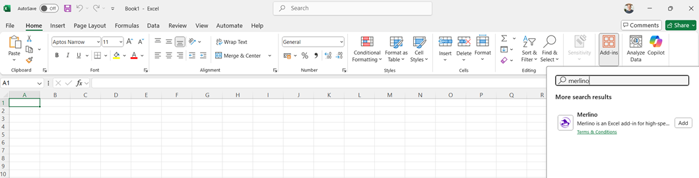

# Camelot

### The Kingdom of Cyber Threat Intelligence

<table width="100%" border="0" cellspacing="0" cellpadding="8">
<tr>
<td align="left" width="20%">

</td>
<td align="center">

</td>
<td align="right" width="20%">

</td>
</tr>
</table>

---

*Built by [X3M.AI](https://x3m.ai) -- Threat Intelligence, Reimagined*

---

> ### Merlino and Morgana are free. If they help you, consider sponsoring the project.
> *Two tools. One developer. Zero subscription fees. Your support keeps them alive.*
>
> 

---

## What Is Camelot?

**Camelot** is the community hub for the X3M.AI cybersecurity ecosystem. It brings together two powerful tools under one roof:

| Tool | What It Does | Install |
|---|---|---|
| **Merlino** | Free Excel Add-in for Cyber Threat Intelligence -- MITRE ATT&CK analysis, coverage heatmaps, AI-powered threat review, CVE enrichment, MISP integration | [Install free](https://x3m.ai/merlino/) |
| **Morgana** | Controlled validation engine for Detection Assurance -- adversary emulation, evidence collection, repeatable security testing workflows | [Request access](https://x3m.ai/contact/) |

Together, they form a complete **threat intelligence and adversary emulation pipeline**: analyze threats in Merlino, then automatically generate and execute Red Team operations on Morgana.

---

## Merlino -- CTI in Excel

Merlino transforms Microsoft Excel into a full-featured Cyber Threat Intelligence workbench. No servers, no databases, no complex deployments -- just install the add-in and start analyzing.

### Key Capabilities

- **MITRE ATT&CK Integration** -- Import and analyze the complete ATT&CK framework (Enterprise, Mobile, ICS, Azure). Techniques, Groups, Software, Campaigns, Data Components, Mitigations, Detection Strategies
- **Threat Profiling** -- Select threat groups relevant to your organization, build a Catalogue, and generate a prioritized coverage heatmap showing exactly which techniques matter most
- **CrossPick Analysis** -- Merlino's proprietary algorithm calculates which techniques are shared across your threat profile, producing a risk-ranked priority matrix
- **AI-Powered Analysis** -- Connect OpenAI, Mistral, or other AI providers to generate automated threat assessments, detection gap analysis, and Red Team scenario planning
- **CVE Enrichment** -- Import recent vulnerabilities from NIST NVD and correlate them with your threat profile to prioritize patching
- **Exploit Database** -- 46,000+ exploits mapped to MITRE ATT&CK techniques
- **MISP Integration** -- Bidirectional pipeline: push your analysis to MISP, pull enriched intelligence back
- **Microsoft Security** -- Import Sentinel detection rules, Defender for Office 365 policies, and Intune configurations
- **Adaptive Reports** -- Generate self-contained HTML reports shareable with anyone
- **Attack Knowledge Graph** -- Interactive force-directed visualization of relationships between threat actors and techniques

### Install Merlino

Merlino is a free Microsoft Excel Add-in available in the Microsoft AppSource marketplace.

**[Merlino Portal](https://x3m.ai/merlino/)**

Requirements:
- Microsoft Excel Desktop (Windows or macOS) or Excel Online
- No installation on the server side -- everything runs in Excel

#### Installation steps

1. Open **Microsoft Excel**
2. Go to **Insert** tab → **Add-ins** → **Get Add-ins**
3. Search for **Merlino** in the Office Add-ins store
4. Click **Add**

Merlino will appear in your Excel ribbon under **Add-ins**. Click it to open the taskpane and get started.

### Documentation

| Guide | Description |
|---|---|
| [Getting Started](docs/merlino/getting-started.md) | Quick start guide for first-time users |
| [Lab 01: Create Organization Threat Profile](laboratories/Merlino%20User%20Guide-Lab%2001--Create-Organization-Threat-Profile.md) | Complete walkthrough building a threat profile from six APT groups |
| [Lab 02: Microsoft Sentinel Detection Coverage](laboratories/Merlino%20User%20Guide-Lab%2002--Microsoft%20Sentinel%20Detection%20Coverage.md) | Analyze your Sentinel rules against your threat profile |
| [Lab 03: Red Team Testing with Morgana](laboratories/Merlino%20User%20Guide-Lab%2003--Red%20Team%20Testing%20with%20Morgana%20Arsenal.md) | Connect Merlino to Morgana and run adversary emulations |

---

## Morgana -- Detection Assurance Validation Engine

**Morgana** is the X3M.AI controlled validation engine for Detection Assurance. It helps security teams validate, measure and improve detection capabilities through controlled adversary emulation, evidence collection and repeatable security testing workflows.

Morgana is available through the **X3M.AI Join Program**, a free access programme for selected security teams, researchers, partners and organisations interested in exploring Detection Assurance in a controlled and responsible way.

Access to Morgana is **free**, but it is provided by request to ensure that the platform is used for authorised security validation, lab-based testing, learning, purple team activities and legitimate Detection Assurance experimentation.

### Join the Morgana Free Access Program

If you want to explore Morgana, request access to the X3M.AI Join Program. Approved participants receive access to the available community release, guidance and materials needed to start using Morgana in a controlled environment.

**[Request Access -- X3M.AI Join Program](https://x3m.ai/contact/)**

The programme is designed for:

- Security teams exploring Detection Assurance
- SOC and detection engineering teams validating their controls
- Purple team practitioners running authorised testing
- Partners interested in X3M.AI Detection Assurance delivery
- Researchers and professionals working in controlled lab environments

> **Responsible use:** Morgana must only be used for authorised security validation activities within environments where testing has been formally approved. It must not be used for unauthorised access, offensive activity or testing against systems without explicit permission.

### How Morgana Supports Detection Assurance

Morgana helps organisations move from assumed detection coverage to evidence-based confidence by supporting:

- **Controlled adversary emulation** -- validate detection logic against realistic attack behaviours
- **Detection evidence** -- understand what was detected, partially detected or missed
- **Threat-informed testing** -- align validation activities to real-world tactics, techniques and procedures
- **Coverage improvement** -- identify gaps and prioritise remediation actions
- **Repeatable validation workflows** -- support continuous measurement and improvement over time

### The Merlino + Morgana Pipeline

The real power of the X3M.AI ecosystem is the automated pipeline between intelligence and validation:

1. **Analyze** -- Build your threat profile in Merlino using MITRE ATT&CK data
2. **Prioritize** -- CrossPick analysis identifies which techniques matter most
3. **Synchronize** -- One click in Merlino automatically creates adversary profiles and operations on Morgana
4. **Execute** -- Launch controlled validation operations directly from Morgana with pre-configured attack chains
5. **Validate** -- Results flow back to Merlino, updating your detection coverage evidence in real time

What normally takes a detection engineering team days of manual work -- building test plans, selecting scripts, configuring operations -- Merlino and Morgana accomplish in seconds.

### Community, Enterprise and Partner Use

The Morgana Join Program provides free access for controlled evaluation, learning and authorised lab use. Enterprise deployments, production use, partner delivery, professional support and commercial Detection Assurance engagements are available through X3M.AI under a separate agreement.

**[Book a FREE Detection Assurance Call](https://x3m.ai/contact/)**

---

## Community and Support

### Get Help

- **[Community Discussions](https://github.com/x3m-ai/Camelot/discussions)** -- Ask questions, share ideas, report issues, show your work
- **[Q&A](https://github.com/x3m-ai/Camelot/discussions/categories/q-a)** -- Get answers from the community and maintainers
- **[Troubleshooting](https://github.com/x3m-ai/Camelot/discussions/categories/troubleshooting)** -- Technical issues and bug reports

### Contribute

- **[Ideas](https://github.com/x3m-ai/Camelot/discussions/categories/ideas)** -- Suggest features, improvements, integrations
- **[Show and Tell](https://github.com/x3m-ai/Camelot/discussions/categories/show-and-tell)** -- Share your dashboards, reports, threat profiles, and use cases
- **[Contributing Guide](CONTRIBUTING.md)** -- How to contribute to documentation and the community

### Join the Project

Merlino and Morgana are growing fast and we are looking for passionate people who want to contribute. Whether you write code, documentation, or just love breaking things -- there is a place for you:

| Role | What You Would Do |
|---|---|
| **TypeScript / React Developer** | Build new taskpanes, improve UI, extend Excel integrations |
| **Python Developer** | Contribute to Morgana (server, agents, routers, execution engine) |
| **CTI Analyst** | Create threat profiles, write use cases, validate ATT&CK mappings |
| **Red Team Operator** | Test Morgana operations, build adversary profiles, write attack chains |
| **Detection Engineer** | Map Sentinel/Defender rules to ATT&CK, improve detection coverage analysis |
| **Technical Writer** | Improve documentation, write tutorials, translate guides |
| **UX / Designer** | Improve taskpane layouts, icons, dark theme, user experience |

Interested? Introduce yourself in [Discussions](https://github.com/x3m-ai/Camelot/discussions) or check the [Contributing Guide](CONTRIBUTING.md).

### Contributing to Merlino

We are absolutely thrilled to welcome any kind of contribution to Merlino. No contribution is too small or too niche -- everything is valuable and appreciated. Here are some ideas to get you started:

| What You Can Contribute | Where It Lives |
|---|---|
| **PowerShell export scripts** -- New scripts to export data, build catalogues, or automate Merlino workflows | [`powershell-export-scripts/`](powershell-export-scripts/) |
| **Templates** -- New or alternative Excel templates for Merlino threat profiles, heatmaps, or reports | [`standard-templates/`](standard-templates/) |
| **Labs** -- Step-by-step guides, use cases, walkthroughs, and practical exercises | [`laboratories/`](laboratories/) |
| **Anything else** -- CVE maps, ATT&CK mappings, detection rules, threat profiles, ideas... | Open a [Discussion](https://github.com/x3m-ai/Camelot/discussions) or a Pull Request |

If you have built something with Merlino -- a useful script, a creative template, a new lab, a clever integration -- please share it. The community grows with your contributions.

### Support the Project

---

### Merlino and Morgana are free. If they help you, consider sponsoring the project.

*Two tools. One developer. Zero subscription fees. Your support keeps them alive.*

 

 

| Your support funds | |
|---|---|
| 🔬 New features and integrations | MITRE ATT&CK updates, new data sources, AI models |
| ☁️ Infrastructure | Cloudflare, CDN, licensing system, hosting |
| 📖 Documentation | Guides, tutorials, user labs |
| 🛡️ Threat intelligence data | CVE, Exploit-DB, MISP feeds |

 

*No subscription. No paywall. Pay what you think it's worth.*

---

### Contact

For partnership inquiries or enterprise collaboration, contact us at **support@x3m.ai**.

---

## License

This repository (documentation and community content) is licensed under the [MIT License](LICENSE).

- **Merlino Add-in** is free, no registration, distributed under its own EULA
- **Morgana** is free, distributed as a binary installer from this repository

---

*Camelot -- Where Intelligence Meets Offense*

**[X3M.AI](https://x3m.ai)** | **[Merlino](https://x3m.ai/merlino/)** | **[Discussions](https://github.com/x3m-ai/Camelot/discussions)**

