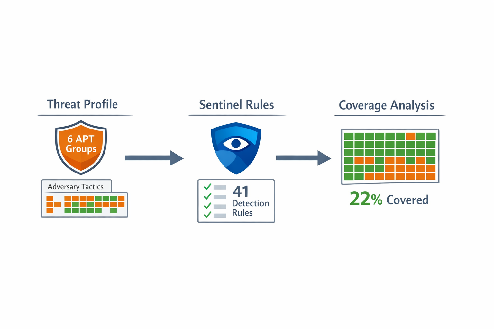
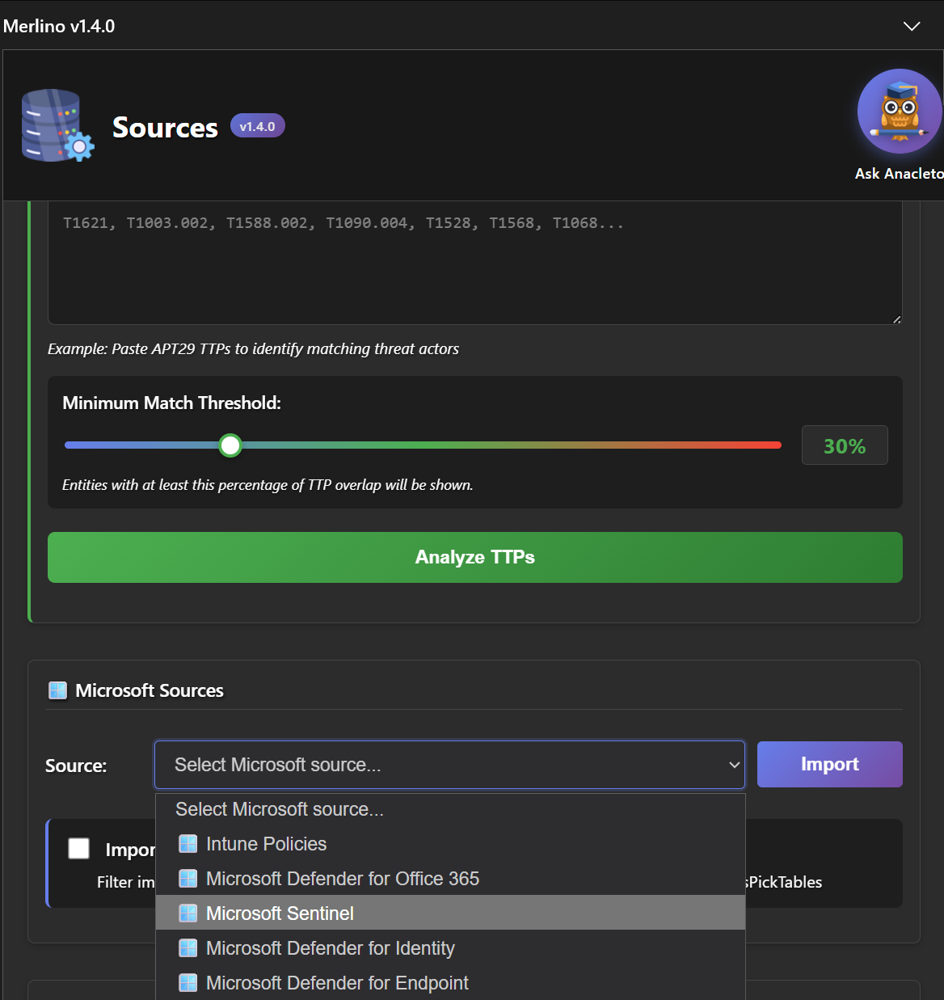
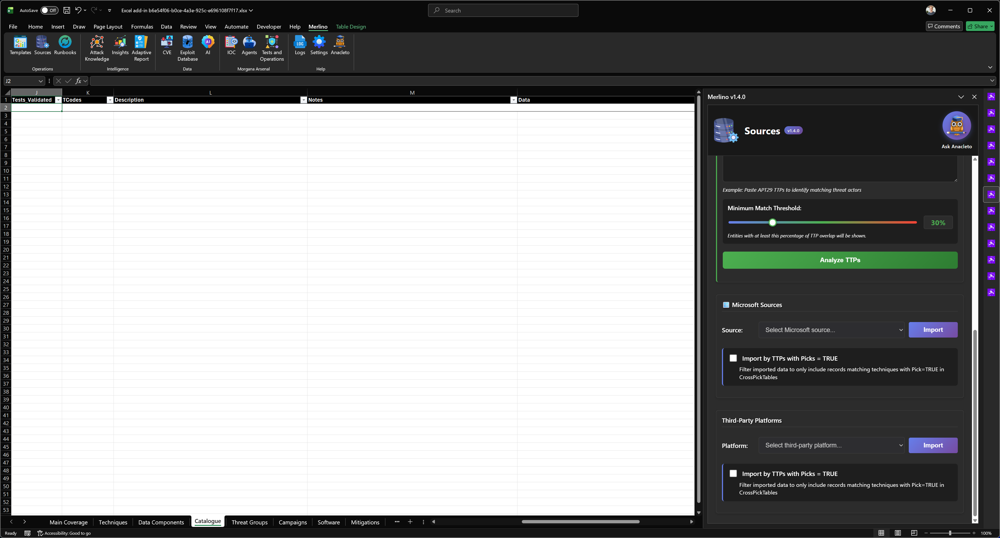
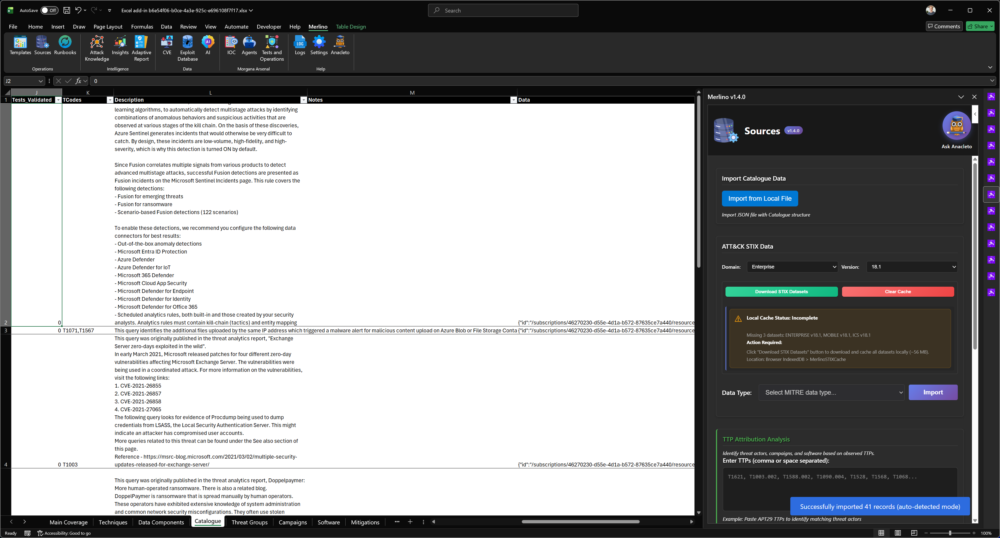
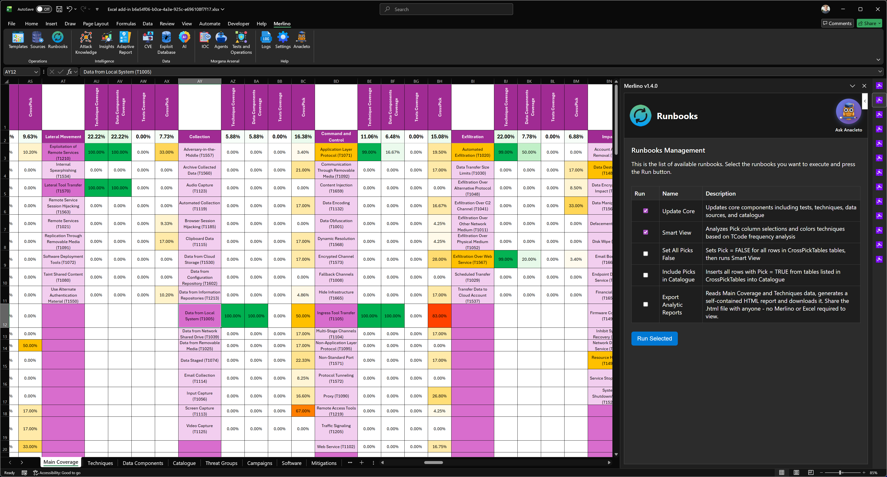
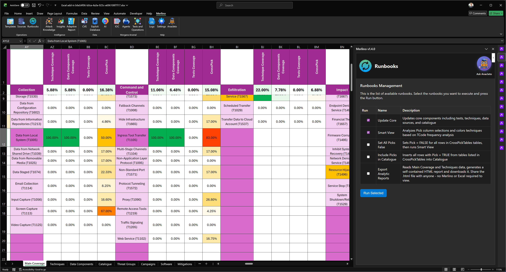
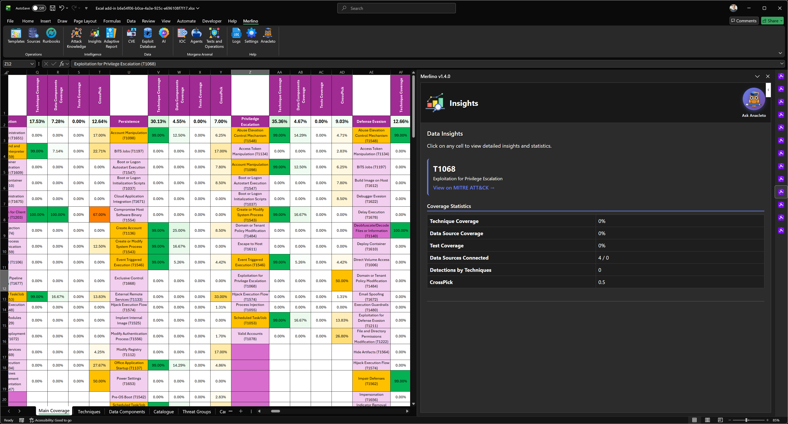
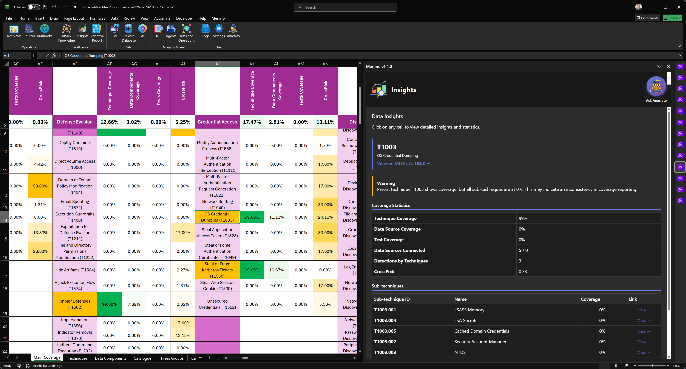
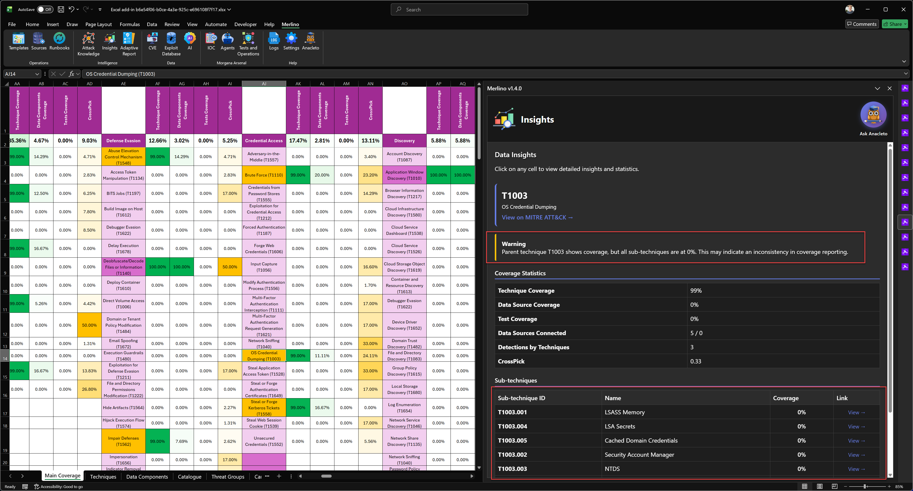

# Merlino User Guide -- Lab 02 -- Microsoft Sentinel Detection Coverage

**Product:** Merlino v1.5.0  
**Publisher:** X3M.AI Ltd  
**Date:** March 2026  
**Audience:** End users, security analysts, detection engineers, and SOC managers  
**Support:** [https://github.com/x3m-ai/Camelot](https://github.com/x3m-ai/Camelot)

---

## Prerequisites

This laboratory **requires completion of Lab 01** (Create Organization Threat Profile). In Lab 01 you built a complete Merlino workbook containing a threat profile based on six APT groups (APT28, APT29, APT33, APT39, APT42, MuddyWater), generated the Catalogue, ran Update Core and Smart View, and explored the Main Coverage heatmap.

If you have not completed Lab 01, go back and complete it first. The analysis in this lab builds directly on the workbook and threat intelligence produced in Lab 01.

---

## Table of Contents

1. [Introduction -- Why Measure SIEM Coverage Against Your Threat Profile](#1-introduction----why-measure-siem-coverage-against-your-threat-profile)
2. [Step 1 -- Download the Sample Sentinel Rules File](#2-step-1----download-the-sample-sentinel-rules-file)
3. [Step 2 -- Clear the Catalogue](#3-step-2----clear-the-catalogue)
4. [Step 3 -- Import Sentinel Rules into the Catalogue](#4-step-3----import-sentinel-rules-into-the-catalogue)
5. [Step 4 -- Run Update Core and Smart View](#5-step-4----run-update-core-and-smart-view)
6. [Step 5 -- Explore Sentinel Coverage on Main Coverage](#6-step-5----explore-sentinel-coverage-on-main-coverage)
7. [Step 6 -- Use Insights to Analyze Detection Gaps](#7-step-6----use-insights-to-analyze-detection-gaps)
8. [Step 7 -- The Critical Lesson: High-Level vs. Sub-Technique Specificity](#8-step-7----the-critical-lesson-high-level-vs-sub-technique-specificity)
9. [Summary and Next Steps](#9-summary-and-next-steps)

---

## 1. Introduction -- Why Measure SIEM Coverage Against Your Threat Profile

Most organizations deploy Microsoft Sentinel (or another SIEM) with dozens or hundreds of detection rules. But a fundamental question remains largely unanswered in most security operations:

**"How much of what our adversaries actually do is covered by our detection rules?"**

This is not a theoretical question. It is the difference between knowing you have 41 active Sentinel rules and knowing that those 41 rules cover only 22% of the techniques used by the threat groups that target your industry. One number gives you a false sense of security. The other tells you exactly where you are exposed.

This is precisely what Merlino measures in this lab.

### What You Will Learn

In this laboratory, you will:

- Import a set of 41 real Microsoft Sentinel detection rules (exported from a production workspace) into Merlino's Catalogue
- Run the analytical engine to map those rules against the MITRE ATT&CK techniques matrix
- See exactly which techniques are covered by your Sentinel rules in the Techniques Coverage column
- Use CrossPick analysis to identify which techniques are both high-priority (used by your threat groups from Lab 01) and uncovered by your current detection rules
- Use Insights to drill into specific techniques and discover a critical problem: many Sentinel rules reference high-level technique IDs (e.g., T1003) without specifying sub-techniques (e.g., T1003.001, T1003.002), leaving dangerous detection gaps hidden behind an apparent "covered" status

### Why This Matters

In Lab 01, you built a threat profile -- you answered the question "what attacks are relevant to us?" In Lab 02, you answer the complementary question: "how much of those attacks can our SIEM actually detect?"

Together, these two analyses form the core of a mature detection engineering program: **know your adversaries, then measure your defenses against them.**


*Lab overview: measuring Sentinel detection coverage against your organization's threat profile.*

---

## 2. Step 1 -- Download the Sample Sentinel Rules File

For this lab, we provide a sample file containing 41 real Microsoft Sentinel alert rules exported from a production workspace. These rules span multiple severity levels (High, Medium, Low) and cover a range of ATT&CK techniques including credential access, lateral movement, execution, defense evasion, and more.

**Download the sample file:**

[merlino-catalogue-sentinel-workspace-Lab02.json](https://merlino-addin.pages.dev/merlino-catalogue-sentinel-workspace-Lab02.json)

Save this file to a known location on your computer (e.g., your Downloads folder or Desktop).

### About This File

This is a Merlino Catalogue export file (JSON format). It contains:

- **41 Sentinel alert rules** from a real workspace (`sentinel-merlino-workspace`)
- Each rule includes: Name, Source, Priority (severity), Enabled status, ATT&CK technique codes (TCodes), full Description, and the complete rule Data (KQL queries, entity mappings, tactics)
- Rule types include Fusion, Scheduled analytics, and ML-based detections
- Severity distribution: High (22 rules), Medium (14 rules), Low (5 rules)

This file is in the same format that Merlino uses for all Catalogue imports, so it loads seamlessly.

### Want to Use Your Own Sentinel Rules Instead?

If you have access to a Microsoft Sentinel workspace and want to analyze your own production rules:

1. In the Merlino ribbon, click **Sources**
2. In the Sources taskpane, go to **Microsoft Sources**
3. Select **Microsoft Sentinel**
4. Click **Import**
5. Merlino will provide a PowerShell script (`.ps1`) to execute -- this script connects to your Azure subscription, reads your Sentinel workspace rules, and exports them in Merlino Catalogue format
6. Run the script in PowerShell and save the output JSON file

You can then use your own file instead of the sample file in the next steps. The process is identical.

### Manual Export (JSON Schema)

If you prefer manual control, you can use the Azure Portal or Azure CLI to export your Sentinel rules and format them into Merlino's Catalogue JSON schema:

```json
{
  "schema": {
    "version": "1.0",
    "source": "Microsoft Sentinel Production",
    "type": "catalogue",
    "totalRecords": 41
  },
  "data": [
    {
      "Pick": false,
      "CrossPick": 0,
      "Name": "Rule Name",
      "Source": "Microsoft Sentinel Production",
      "Priority": "High",
      "TCodes": "T1003,T1059",
      "Description": "Rule description...",
      "Data": "{...full rule JSON...}"
    }
  ]
}
```

### Combining Sentinel Rules with Threat Groups

For maximum insight, you can run the analysis with both your threat groups (from Lab 01) AND your Sentinel rules in the same Catalogue. Instead of clearing the Catalogue in Step 2, simply import the Sentinel rules alongside the existing group entries. Merlino will calculate coverage across all Catalogue entries simultaneously, showing you:

- Which techniques your adversaries use (from groups)
- Which techniques your Sentinel rules detect (from rules)
- Where the overlap is (you are protected)
- Where the gaps are (you are exposed)

This combined analysis is the most powerful way to use Merlino for detection engineering prioritization.


*The sample Sentinel rules file ready for download, or alternatively import your own rules via the Sources taskpane.*

---

## 3. Step 2 -- Clear the Catalogue

Before importing the Sentinel rules, you need to clear the existing Catalogue data from Lab 01. The Catalogue currently contains the threat group entries from your previous analysis. For this lab, we want to start with a clean Catalogue that contains only Sentinel rules, so we can measure detection coverage in isolation.

### How to Clear the Catalogue

1. Navigate to the **Catalogue** sheet in your workbook
2. Select all the data rows below the header row
   - Click on the first data cell in column A (row 2)
   - Press **Ctrl+Shift+End** to select all data rows down to the last entry
3. Right-click and select **Delete** > **Table Rows** (or press **Ctrl+-** and choose "Entire Row")
4. Verify that the header row is still intact with all column names (Pick, CrossPick, Name, Source, Priority, Enabled, Validation_Score, Tests, Expected_Tests, Tests_Validated, TCodes, Description, Notes, Data)

**IMPORTANT:** Do NOT delete the header row. Merlino needs the table structure and column headers to function correctly. Only delete the data rows.

After clearing, your Catalogue should show an empty table with just the header row.


*The Catalogue sheet after clearing all data rows. The header row must remain intact.*

---

## 4. Step 3 -- Import Sentinel Rules into the Catalogue

Now import the Sentinel rules file into the empty Catalogue.

### Steps

1. In the Merlino ribbon, click **Sources**
2. In the Sources taskpane, click **Import from local sources**
3. In the file picker dialog, navigate to where you saved the Sentinel file
4. Select **merlino-catalogue-sentinel-workspace-Lab02.json** (or your own exported file)
5. Click **Open**

Merlino will read the JSON file and populate the Catalogue table with all 41 Sentinel rules. Each row represents one detection rule, with:

- **Name** -- The Sentinel rule display name (e.g., "LSASS Credential Dumping with Procdump")
- **Source** -- "Microsoft Sentinel Production"
- **Priority** -- Rule severity (High, Medium, Low)
- **TCodes** -- The MITRE ATT&CK technique codes that the rule maps to (e.g., "T1003", "T1059,T1562")
- **Description** -- The full rule description
- **Data** -- The complete rule definition (KQL query, entity mappings, tactics, etc.)

Notice that some rules have **empty TCodes** (e.g., "Advanced Multistage Attack Detection") -- these are rules that reference ATT&CK tactics but do not specify individual techniques. Merlino handles this correctly: rules without technique codes will not appear in technique-level coverage analysis, which is accurate because those rules provide tactical-level detection rather than technique-specific detection.


*41 Sentinel rules imported into the Catalogue. Note the TCodes column showing ATT&CK technique mappings.*

---

## 5. Step 4 -- Run Update Core and Smart View

With the Sentinel rules loaded in the Catalogue, run the analytical engine to process them.

### Steps

1. In the Merlino ribbon, click **Runbooks**
2. Select **Update Core** from the runbook list
3. Hold **Ctrl** and also select **Smart View**
4. Click **Select Runbook to Run**

Merlino will:

- Read all 41 Catalogue entries and extract their TCodes
- Map each technique code against the full ATT&CK Techniques matrix
- Calculate the Techniques Coverage percentage for every technique
- Apply the CrossPick algorithm to determine which techniques have the highest overlap between your threat profile groups (from the Groups sheet, still populated from Lab 01) and your detection rules
- Update the Smart View color coding across the Main Coverage sheet

This process typically takes a few seconds. When complete, you will see a success notification.


*Running Update Core and Smart View runbooks to process the Sentinel detection rules.*

---

## 6. Step 5 -- Explore Sentinel Coverage on Main Coverage

Navigate to the **Main Coverage** sheet. This is where the analysis becomes immediately visible.

### What You See

The Main Coverage sheet now displays the ATT&CK techniques matrix with color-coded coverage based on your Sentinel rules:

- **Green cells** -- Techniques that are covered by at least one Sentinel detection rule in your Catalogue
- **Orange cells** -- Techniques that are used by your threat groups (from Lab 01) but are NOT covered by any Sentinel rule
- **Red cells** -- High-priority techniques with significant threat overlap and zero detection coverage
- **Grey/uncolored cells** -- Techniques that are neither used by your threat groups nor covered by your Sentinel rules

### The Techniques Coverage Column

Look at the **Techniques Coverage** column (TCov). This column shows the percentage of coverage for each technique:

- A technique with **100%** means at least one Sentinel rule explicitly maps to it
- A technique with **0%** means no Sentinel rule covers it -- despite the fact that your threat groups use it

### The CrossPick Column

The **CrossPick** column is where the real insight emerges. CrossPick shows the intersection of:

1. **How many of your selected threat groups use this technique** (from Lab 01)
2. **Whether your Sentinel rules cover it** (from this lab)

A technique with a **high CrossPick percentage and 0% Techniques Coverage** is a critical gap: it is actively used by multiple threat actors targeting your organization, and you have no Sentinel rule detecting it.

These are the techniques you should prioritize when building new detection rules.


*Main Coverage sheet showing Sentinel detection coverage. Green = covered, orange = gap, the CrossPick column reveals the most critical detection priorities.*

---

## 7. Step 6 -- Use Insights to Analyze Detection Gaps

Now let's use Insights to drill deeper into individual techniques and uncover the quality of your detection coverage.

### Steps

1. In the Merlino ribbon, click **Insights**
2. On the Main Coverage sheet, click on an **orange cell** -- a technique that your threat groups use but Sentinel does not cover
3. The Insights taskpane opens and shows detailed information about that technique

Insights will display:

- The technique name, ID, and description from ATT&CK
- Which threat groups use this technique (and how many of your picked groups)
- The current Techniques Coverage status (0% in this case)
- Which Catalogue entries (if any) reference this technique
- Sub-techniques and whether they are individually covered

### Now Click on a Green Cell

This is where the analysis becomes truly powerful. Click on a **green cell** -- a technique that appears to be covered.

For example, click on **T1003 -- OS Credential Dumping**. The Insights panel shows that this technique is "covered" because the Sentinel rule "LSASS Credential Dumping with Procdump" maps to T1003.

But look at the sub-techniques:

| Sub-Technique | ID | Covered? |
|---|---|---|
| LSASS Memory | T1003.001 | 0% |
| Security Account Manager | T1003.002 | 0% |
| NTDS | T1003.003 | 0% |
| LSA Secrets | T1003.004 | 0% |
| Cached Domain Credentials | T1003.005 | 0% |
| DCSync | T1003.006 | 0% |
| Proc Filesystem | T1003.007 | 0% |
| /etc/passwd and /etc/shadow | T1003.008 | 0% |

The Sentinel rule references **T1003** (the parent technique) but does not specify which sub-techniques it actually detects. In reality, the "LSASS Credential Dumping with Procdump" rule specifically detects T1003.001 (LSASS Memory) -- but because the rule only declares T1003, Merlino correctly reports the parent as covered while showing all sub-techniques at 0%.


*Insights on T1068 -- Exploitation for Privilege Escalation: this technique has a high CrossPick percentage (multiple threat groups from your profile use it) but zero Sentinel rules cover it. This is a critical detection gap -- high threat relevance, no detection whatsoever.*


*Insights on T1003 (OS Credential Dumping): the parent technique appears covered, but all sub-techniques are at 0% because the Sentinel rule only declares the high-level T1003 code.*

---

## 8. Step 7 -- The Critical Lesson: High-Level vs. Sub-Technique Specificity

This is the most important takeaway from Lab 02, and it has direct implications for your detection engineering program.

### The Problem

Many Sentinel rules -- and SIEM rules in general across all platforms -- reference **high-level ATT&CK technique IDs** (e.g., T1003, T1059, T1562) without specifying the exact **sub-techniques** they detect (e.g., T1003.001, T1059.001, T1562.001).

This creates a dangerous illusion of coverage:

- Your coverage dashboard shows T1003 as "detected" -- green checkmark, everything looks fine
- But the rule only detects procdump-based LSASS dumps (T1003.001)
- An attacker using DCSync (T1003.006) or SAM database extraction (T1003.002) will not trigger the rule
- During an incident, the SOC sees "Credential Dumping detected" but has no specificity about which exact technique variant was used
- The response team cannot determine the exact attack vector, making containment slower and less effective

### Why Sub-Technique Specificity Matters

When a Sentinel rule maps to a parent technique like T1003, it typically detects **one specific variant** of that technique. But parent techniques like T1003 can have 8 or more sub-techniques, each representing a completely different attack method, different tools, different indicators, and different response procedures.

Consider the real impact on incident response:

| Scenario | With High-Level T1003 | With Specific T1003.001 |
|---|---|---|
| Alert fires | "Credential Dumping detected" | "LSASS Memory dump via Procdump detected" |
| Analyst knows | Something related to credentials happened | Attacker is dumping LSASS process memory |
| Response action | Need to investigate further to understand what happened | Immediately isolate host, check for procdump artifacts, analyze memory dump |
| Attack chain analysis | Cannot determine if this is part of lateral movement or privilege escalation | Clear link to credential harvesting for lateral movement |
| Detection gap awareness | "We cover credential dumping" (false confidence) | "We cover LSASS dumps but not DCSync, NTDS, or SAM harvesting" (accurate gap awareness) |

### The Recommendation

When creating or reviewing Sentinel rules:

1. **Always specify sub-technique IDs** in the rule's technique mapping (e.g., T1003.001 instead of T1003)
2. **Review existing rules** that only declare parent techniques -- determine which specific sub-technique they actually detect and update the mapping
3. **Use Merlino's Insights** to identify where your rules declare parent-level coverage that masks sub-technique gaps
4. **Build separate rules** for different sub-techniques when they require different detection logic, data sources, or response procedures

This principle applies not only to Microsoft Sentinel but to any SIEM or detection platform that uses MITRE ATT&CK mappings: Splunk, QRadar, Elastic, CrowdStrike, Palo Alto Cortex XSOAR, and any custom detection framework.

Merlino makes this problem visible. Without this analysis, the gap remains hidden behind a false "covered" status on every compliance dashboard.


*The critical difference between high-level technique coverage (T1003 = "covered") and sub-technique specificity (T1003.001 through T1003.008 = all at 0%). Merlino reveals what compliance dashboards hide.*

---

## 9. Summary and Next Steps

### What You Accomplished in This Lab

| Step | What You Did | What It Produced |
|---|---|---|
| Downloaded sample file | Obtained 41 real Sentinel rules from a production workspace | A Merlino Catalogue JSON file ready for import |
| Cleared the Catalogue | Removed Lab 01 group entries to isolate Sentinel analysis | An empty Catalogue with intact table structure |
| Imported Sentinel rules | Loaded 41 rules with ATT&CK technique mappings | A populated Catalogue with detection rule data |
| Ran Update Core + Smart View | Processed rules through the analytical engine | Updated coverage percentages and color-coded heatmap |
| Explored Main Coverage | Visualized detection coverage vs. threat profile | Identified covered techniques (green) and gaps (orange) |
| Used Insights | Drilled into individual techniques for detailed analysis | Discovered sub-technique gaps hidden behind parent-level coverage |
| Learned the critical lesson | Understood high-level vs. sub-technique specificity | Actionable knowledge for improving SIEM rule quality |

### Key Takeaways

1. **Knowing how many Sentinel rules you have is not the same as knowing how much of your threat landscape they cover.** 41 rules may cover 80% of your techniques or 15% -- the only way to know is to measure.
2. **CrossPick analysis identifies your most critical detection gaps** -- techniques that are both widely used by your adversaries and completely uncovered by your SIEM.
3. **Parent-level ATT&CK mappings in SIEM rules create a false sense of coverage.** Always specify sub-techniques in your detection rules.
4. **Merlino makes detection coverage a measurable, trackable metric** rather than a subjective assessment. You can re-run this analysis every time you add or modify Sentinel rules to track improvement over time.
5. **The workbook itself is a living document.** Save it, share it with your SOC team, present it to management -- it contains all the evidence and analysis in a portable, interactive format.

### What's Next

- **Lab 03 -- Red Team Testing with Morgana Arsenal:** Take the techniques that are NOT covered by Sentinel and run Red Team operations to validate whether your defenses can detect them through other means (EDR, network monitoring, manual investigation). This closes the loop: intelligence (Lab 01) > detection measurement (Lab 02) > validation testing (Lab 03).
- **Combine all data:** Import both your threat groups AND Sentinel rules into the same Catalogue for a unified view of threats vs. defenses.
- **Use AI Analysis:** Click the **AI** button in the Merlino ribbon and run an AI-powered review of your coverage gaps for automated prioritization and detection rule suggestions.

---

**End of Lab 02**

*For additional help, use Anacleto within any taskpane or visit the [Camelot community](https://github.com/x3m-ai/Camelot/discussions).*
