# Merlino User Guide -- Lab 03 -- Red Team Testing with Morgana

**Product:** Merlino v0.3.0  
**Publisher:** X3M.AI Ltd  
**Date:** March 2026  
**Audience:** Red Team operators, SOC analysts, detection engineers, and security architects  
**Support:** [https://github.com/x3m-ai/Camelot](https://github.com/x3m-ai/Camelot)

---

## Prerequisites

This laboratory **requires completion of Lab 01 and Lab 02**.

- In **Lab 01** you built a complete threat profile based on six APT groups, generated the Catalogue, ran Update Core and Smart View, and analyzed the Main Coverage heatmap.
- In **Lab 02** you imported 41 Microsoft Sentinel detection rules, measured SIEM coverage against your threat profile, and identified techniques that are NOT covered by your detection rules.

**Lab 03 closes the loop.** You will now take the techniques from your threat profile and test them against a real target machine using Morgana -- X3M.AI's dedicated Red Team execution platform, purpose-built to work seamlessly with Merlino. After running tests, you will synchronize the results back into Merlino to see exactly which techniques were tested, which succeeded, and which failed -- giving you a complete, measurable picture of your security posture: intelligence (Lab 01) > detection (Lab 02) > validation (Lab 03).

If you have not completed Lab 01 and Lab 02, go back and complete them first. This lab builds directly on the workbook produced in those labs.

---

## Table of Contents

1. [Introduction -- Why Red Team Validation Matters](#1-introduction----why-red-team-validation-matters)
2. [Step 1 -- Prepare the Tests Sheet](#2-step-1----prepare-the-tests-sheet)
3. [Step 2 -- Synchronize Chains](#3-step-2----synchronize-chains)
4. [Step 3 -- Install Morgana](#4-step-3----install-morgana)
5. [Step 4 -- Configure Merlino to Connect to Morgana](#5-step-4----configure-merlino-to-connect-to-morgana)
6. [Step 5 -- Configure MISP Connection](#6-step-5----configure-misp-connection)
7. [Step 6 -- Deploy a Morgana Agent on the Target Machine](#7-step-6----deploy-a-morgana-agent-on-the-target-machine)
8. [Step 7 -- Synchronize Tests (First Sync)](#8-step-7----synchronize-tests-first-sync)
9. [Step 8 -- Run Tests in Morgana](#9-step-8----run-tests-in-morgana)
10. [Step 9 -- Synchronize Back to Merlino (Post-Execution)](#10-step-9----synchronize-back-to-merlino-post-execution)
11. [Step 10 -- Understanding the Tests Table After Synchronization](#11-step-10----understanding-the-tests-table-after-synchronization)
12. [Step 11 -- Push Intelligence to MISP](#12-step-11----push-intelligence-to-misp)
13. [Step 12 -- Import IOC Data from MISP](#13-step-12----import-ioc-data-from-misp)
14. [Step 13 -- Visualize IOC Clusters](#14-step-13----visualize-ioc-clusters)
15. [Step 14 -- Explore the Agents Dashboard](#15-step-14----explore-the-agents-dashboard)
16. [The Complete Security Validation Loop](#16-the-complete-security-validation-loop)
17. [Summary and Next Steps](#17-summary-and-next-steps)

---

## 1. Introduction -- Why Red Team Validation Matters

In Lab 02, you measured how much of your threat landscape is covered by Microsoft Sentinel detection rules. You found gaps -- techniques that your adversaries use but your SIEM does not detect. That measurement is essential, but it answers only one question: *"Do we have a rule for this technique?"*

It does NOT answer the more important question:

**"If an adversary executes this technique against our infrastructure, will we actually detect it, stop it, or even notice it?"**

The difference between these two questions is the difference between theoretical coverage and validated coverage. A Sentinel rule may exist for T1003 (OS Credential Dumping), but does it fire when someone actually runs Mimikatz on your domain controller? Does your EDR block the execution? Does your SOC team receive the alert, triage it, and respond within your SLA? The only way to answer these questions is to test.

### What You Will Do in This Lab

In this laboratory, you will:

- **Prepare Merlino's Tests table** with the techniques from your Catalogue (the same ones analyzed in Lab 01 and Lab 02)
- **Install Morgana** -- X3M.AI's dedicated Red Team execution platform -- on a server or virtual machine
- **Deploy a Morgana agent** on a Windows target machine to serve as the test endpoint
- **Synchronize Chains** to push your Catalogue entries to Morgana as chains with ordered scripts
- **Execute attack tests** against the target machine using real MITRE ATT&CK techniques and scripts
- **Synchronize results back into Merlino** to see which scripts succeeded, failed, or were blocked
- **Push intelligence to MISP** using the IOC taskpane to enrich your threat intelligence platform
- **Import IOC data back from MISP** and visualize relationships using the IOC Cluster Graph

This is the final piece of the puzzle: after this lab, your Merlino workbook will contain the complete cycle -- **threat intelligence, detection coverage, and Red Team validation results** -- all in a single, measurable, auditable document.

### Architecture Overview

```
+------------------+       +---------------------+       +------------------+
|                  |       |                     |       |                  |
|     MERLINO      | <---> |      MORGANA        | <---> |  TARGET MACHINE  |
|   (Excel Add-in) |       |  (Python/FastAPI     |       |  (Go Agent as    |
|                  |       |   Server :8888)     |       |   NT Service)    |
+--------+---------+       +----------+----------+       +------------------+
         |                            |
         |                            |
+--------v---------+       +----------v----------+
|                  |       |                     |
|      MISP        |       |   Atomic Red Team   |
| (Threat Intel)   |       |   Scripts Library   |
|                  |       |                     |
+------------------+       +---------------------+
```

Merlino sends test definitions to Morgana via the synchronization API. Morgana queues jobs for the target agents. The Go agent (installed as an NT Service on Windows or systemd on Linux) polls the server, executes scripts, and reports results. Results flow back to Merlino through synchronization. Merlino can then push the intelligence to MISP for broader threat intelligence sharing and correlation.

---

## 2. Step 1 -- Prepare the Tests Sheet

Before synchronizing your Catalogue with the Tests table, you need to make sure the Tests sheet is clean. If there are leftover rows from a previous session or earlier experimentation, they must be removed -- but the table header must remain intact.

### Navigate to the Tests Sheet

1. In your Merlino workCatalogue Description --> Tests Descriptionbook, click on the **Tests** sheet tab at the bottom of the Excel window.
2. Examine the sheet. If you see data rows below the header row, you need to clear them.

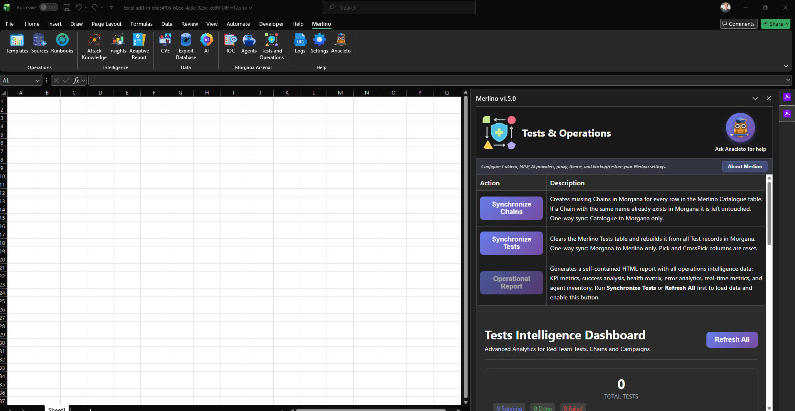
*Figure 300: The Tests sheet. If data rows exist below the header, select and delete them. Never delete the header row.*

### Clear Existing Data Rows

If the Tests sheet contains data:

1. Click on the **first data row** (the row immediately below the header).
2. Hold **Shift** and click the **last data row** to select all data rows.
3. Right-click and select **Delete Row** (or press **Ctrl+Minus**).
4. **Do NOT delete the header row.** The header row contains the column names that Merlino relies on: Pick, CrossPick, TCodes, Name, Description, Test, Chain, State, Agents, Group, Status, Output, Command, and others.

> **WARNING:** If you accidentally delete the header row, the table structure will break. In that case, reload the template (Templates taskpane) and re-run the import process from Lab 01.

After clearing, the Tests sheet should show only the header row with no data below it.

---

## 3. Step 2 -- Synchronize Chains

Now you will push your Catalogue entries to Morgana as chains. Each Catalogue entry becomes a chain containing ordered scripts that implement the ATT&CK techniques listed in the TCodes column.

### Open the Tests & Operations Taskpane

1. Click the **Tests & Operations** button in the Merlino ribbon (Operations group).
2. The taskpane opens with two main buttons at the top:
   - **Synchronize Chains** -- reads the Catalogue, connects to Morgana, and creates chains with attack scripts for each entry. After this you go to Morgana and execute the chains.
   - **Synchronize Tests** -- pulls execution results back from Morgana into the Tests table after you have run chains in Morgana

### Click Synchronize Chains

1. Click the **Synchronize Chains** button.
2. Merlino reads all rows from the Catalogue table and sends them to Morgana via the API.
3. For each Catalogue entry, Morgana creates a **chain** -- an ordered sequence of scripts that implement the ATT&CK techniques in the TCodes column.
4. The Tests table is populated with the chain data:
   - Catalogue **Name** --> Tests **Test** (test name) and **Chain** (chain name)
   - Catalogue **TCodes** --> Tests **TCodes**
   - Catalogue **Description** --> Tests **Description**

5. A notification appears confirming how many chains were created and how many scripts were mapped.

At this point, your Catalogue entries exist as chains in Morgana -- the same techniques and rules you analyzed in Lab 01 and Lab 02. The chains are ready to be executed directly from the Morgana web UI (see Step 8).

---

## 4. Step 3 -- Install Morgana

Morgana is X3M.AI's dedicated Red Team execution platform, purpose-built for Purple Teaming and tight integration with Merlino. It features a Python/FastAPI server, a Go-based agent, and its own web UI.

### Requirements

| Component | Requirement |
|-----------|-------------|
| Server OS | Windows 10 / 11 / Server 2019 or later |
| RAM | 512 MB minimum, 1 GB recommended |
| Disk | 500 MB minimum |
| Network | Agent machines must reach the server on **TCP 8888** |
| Browser | Chrome 120+ or Edge 120+ (for the web UI) |

### Download and Install

Morgana is distributed as a self-contained Windows installer through the **Camelot community repository**.

1. Download the latest installer:

   **[Download Morgana-Server-Setup.exe](https://github.com/x3m-ai/Camelot/raw/main/morgana/Install/Morgana-Server-Setup.exe)**

   > **Browser / SmartScreen warning:** Your browser or Windows SmartScreen may show a security warning on download. This is expected — the executable is **digitally signed by X3M.AI Ltd** and is safe to run. Click **Keep** in the browser or **Run anyway** in SmartScreen to proceed.

2. Right-click the downloaded file and choose **Run as Administrator**.

3. Follow the installer wizard (or use `/VERYSILENT` for a silent install).

   The installer will automatically:
   - Install Morgana Server as a Windows NT Service (`Morgana`) with auto-start on boot
   - Generate a self-signed TLS certificate and **install it into the Windows Trusted Root store**
   - Open firewall port 8888 (TCP Inbound)
   - Load the Atomic Red Team script library (4,500+ techniques)
   - Optionally create a **desktop shortcut** (if selected during setup) — double-click it to open the Morgana web UI directly

> **No Git, no Python, no dependencies required.** The installer is fully self-contained (~25 MB).

### Verify the Installation

Once the installer completes, open a browser and navigate to:

```
https://localhost:8888/ui/
```

The Morgana web UI shows the full dashboard for managing agents, scripts, chains, tests, and campaigns.

> **Note:** The installer installs the certificate into the Windows Trusted Root store automatically. On a clean machine the browser and Excel will trust it immediately — no manual steps required.

### SSL Certificate

HTTPS is required because Microsoft Excel enforces strict security: the Office.js runtime blocks all unencrypted HTTP communication. The installer handles certificate generation and trust automatically — on a fresh installation everything works out of the box.

**For production environments**, replace the self-signed certificate by placing your own files at:
- `C:\ProgramData\Morgana\certs\server.crt`
- `C:\ProgramData\Morgana\certs\server.key`

Then restart the Morgana service.

### API Key

To get the API key you need to connect Merlino to Morgana:

1. Open the Morgana web UI: `https://localhost:8888/ui/` (or `https://<SERVER-IP>:8888/ui/` if on a separate machine)
2. Go to **Admin** in the left sidebar
3. Click **Generate API Key**
4. **Copy the key immediately** and save it somewhere safe — it will not be shown again

You will paste this key into Merlino Settings in the next step.

> **IMPORTANT:** Keep this key secret. Treat it like a password.

### Server IP Address

If Morgana runs on a separate machine or VM, note its IP address for configuring Merlino. Run `ipconfig` in PowerShell and look for the IPv4 address of your network adapter. You will need this IP in the next step.

---

## 5. Step 4 -- Configure Merlino to Connect to Morgana

Now that Morgana is running, you need to tell Merlino where to find it.

### Open the Settings Taskpane

1. Click the **Settings** button in the Merlino ribbon (Help group).
2. Scroll to the **Morgana** section.

### Enter the Connection Details

1. In the **Server URL** field, enter the Morgana URL: `https://<SERVER-IP>:8888`
   - Replace `<SERVER-IP>` with the actual IP address of your Morgana server (e.g., `https://192.168.1.10:8888`)
   - If Morgana runs on the same machine as Excel, use `https://localhost:8888`
2. In the **API Key** field, paste the Morgana API key you generated from the Admin section of the Morgana web UI.
3. Click **Save**.
4. Click **Test Connection**.
5. If the connection is successful, the status indicator turns **green** with a confirmation message.

> **Troubleshooting:** If the test fails:
> - Verify that Morgana is running (`.\Morgana.ps1 status`).
> - Verify the server is reachable (`ping <SERVER-IP>` from your Windows machine).
> - Check that port 8888 is not blocked by a firewall.
> - If using a self-signed certificate, ensure it is imported into the Windows Trusted Root Certificate Store (see Step 3).
> - Open the **Logs** taskpane in Merlino to read the detailed error message.

---

## 6. Step 5 -- Configure MISP Connection

MISP (Malware Information Sharing Platform) can be installed alongside Morgana or on a separate machine. Configuring it now allows you to push threat intelligence from Merlino to MISP and pull IOC data back later in this lab.

### Create a MISP API Key

1. Open a browser and navigate to `https://<VM-IP>:8443`.
2. Accept the self-signed certificate warning.
3. Log in with the default MISP credentials: **admin@misp.test** / **admin**.
4. Once logged in, go to **Administration** in the top menu and click **List Auth Keys**.
5. If an existing key is present, delete it (click the trash icon).
6. Click **Add authentication key** (or **New authentication key**).
7. Leave the defaults and click **Submit**.
8. **Copy the generated API key immediately** -- it will not be shown again.

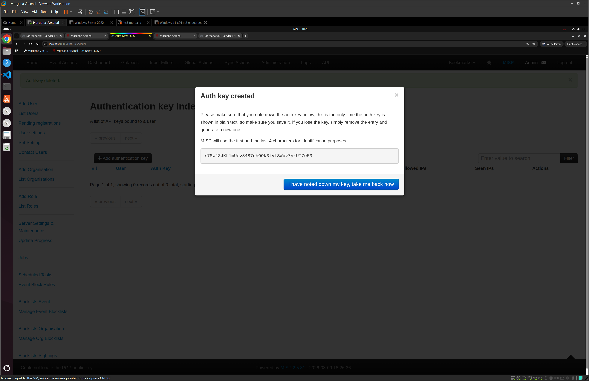
*Figure 304: MISP Auth Keys management. Delete old keys and create a new one for Merlino integration.*

### Enter MISP Details in Merlino Settings

1. Back in the Merlino **Settings** taskpane, scroll to the **MISP** section.
2. In the **MISP URL** field, enter: `https://<MISP-IP>:8443`
   - This can be the same machine as Morgana or a separate MISP server.
3. In the **API Key** field, paste the MISP authentication key you just created.
4. Click **Save**.
5. Click **Test Connection** for MISP.
6. If successful, the status indicator turns **green**.

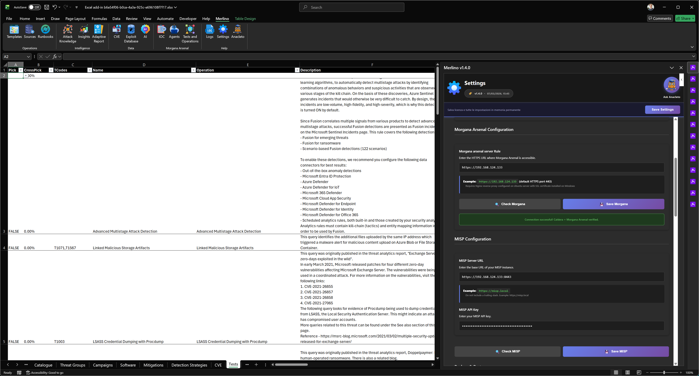
*Figure 305: Both Morgana and MISP connections configured and verified (green status indicators).*

> **Note:** If the MISP connection test fails with a certificate error, this is expected for self-signed certificates. Merlino handles self-signed certificates, but some corporate proxy configurations may interfere. Check the Logs taskpane for details.

---

## 7. Step 6 -- Deploy a Morgana Agent on the Target Machine

Before Morgana can execute any tests, it needs an **agent** running on the target machine. The Morgana agent is a lightweight Go binary (~5 MB) that installs as a persistent OS service, polls the Morgana server for jobs, executes scripts (attack techniques), and reports results back.

### Prepare a Target Machine

For this lab, you need a **Windows virtual machine** to serve as the attack target. This can be:

- A Windows 10/11 VM in VMware or VirtualBox
- A Windows Server VM
- Any Windows machine on the same network as the Morgana server
- The same machine running Morgana (all-in-one topology for quick lab setup)

> **WARNING:** Only deploy agents on machines you own and control. Never deploy agents on production systems without explicit authorization. This lab should be conducted in an isolated lab environment.

### Deploy the Agent from the Morgana Web UI

1. Open the Morgana web UI in your browser: `https://<SERVER-IP>:8888/ui/`.
2. Navigate to the **Agents** section.
3. Click **Deploy Agent**.
4. The deploy modal shows a one-liner command for Windows and Linux. Copy it and run it as Administrator on the target machine.

   For Windows, the command looks like:

```powershell
curl.exe -k -o morgana-agent.exe https://<SERVER-IP>:8888/download/morgana-agent.exe; .\morgana-agent.exe install --server https://<SERVER-IP>:8888 --token <API_KEY>
```

5. Open **PowerShell as Administrator** on the target Windows machine.
6. Navigate to a working folder (e.g., `cd C:\Temp`).
7. Paste and execute the command.

The command does two things:
1. **Downloads** the Morgana agent binary from the server
2. **Installs** the agent as a Windows NT Service (`MorganaAgent`) that:
   - Registers with the Morgana server (one-time enrollment)
   - Creates a persistent service that starts automatically on boot
   - Begins polling the server every 30 seconds for jobs

**For Linux targets**, the equivalent one-liner installs the agent as a systemd service:

```bash
curl -ksSL -o morgana-agent https://<SERVER-IP>:8888/download/morgana-agent && chmod +x morgana-agent && sudo ./morgana-agent install --server https://<SERVER-IP>:8888 --token <API_KEY>
```

### Agent Execution on the Windows Target

The following screenshot shows the agent deployment running on the Windows target machine. Once the install command completes, the agent registers with the Morgana server, creates the NT Service, and begins its beacon loop.

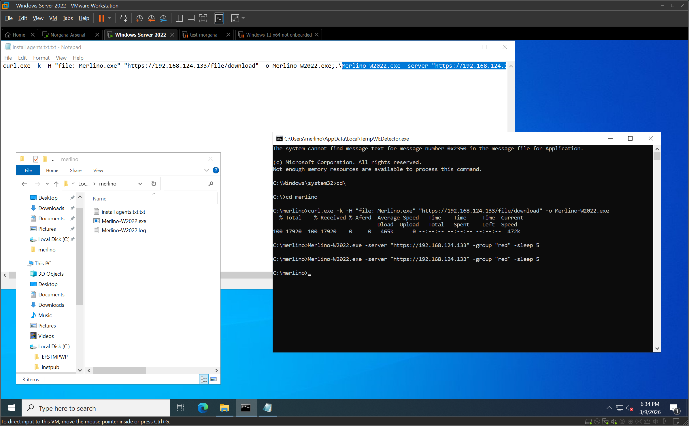
*Figure 313: The Morgana agent installing on the Windows target machine. The binary is downloaded, the NT Service is created, and the agent establishes a connection to the Morgana server.*

### Verify the Agent is Connected

1. Back in the Morgana web UI, go to **Agents**.
2. You should see the newly deployed agent listed with its hostname, platform (Windows), IP address, and status (online).
3. The agent's **last seen** timestamp should be recent (within the last 30 seconds, matching the beacon interval).

> **Agent Details:** Each agent is identified by a unique **paw** (short ID). The agent configuration, token, and work directories are stored in `C:\ProgramData\Morgana\` on Windows or `/var/lib/morgana/` on Linux. The agent writes an immutable execution audit log for every job it runs.

### Agent Source Code (Optional -- Advanced)

The agent binary deployed by Morgana is pre-compiled and served directly by the server. If you prefer to audit the source code, build your own binary, or distribute a custom-compiled agent, the full Go 1.22 source code is publicly available in the **Camelot community repository**:

**[github.com/x3m-ai/Camelot -- morgana/morgana-agent/](https://github.com/x3m-ai/Camelot/tree/main/morgana/morgana-agent)**

That folder contains the complete source and build instructions for Windows and Linux. You can compile it yourself and install it using the same `--server` and `--token` arguments as the pre-built binary. This is completely transparent -- there are no differences between the pre-built binary and what you build from that source.

---

## 8. Step 7 -- Synchronize Tests (First Sync)

Now that you have:
- Chains created in Morgana (from Step 2)
- Morgana running and connected (from Steps 3-4)
- An agent deployed on the target machine (from Step 6)

You are ready to do the first synchronization. This registers the chains in the Merlino Tests table so you can track results after execution.

### Open the Tests & Operations Taskpane

1. Click the **Tests & Operations** button in the Merlino ribbon.
2. You see the two synchronization buttons and the Operations Intelligence Dashboard below them.

### Click Synchronize Tests

1. Click the **Synchronize Tests** button.
2. Merlino reads the chains from Morgana via the API (`/api/v2/merlino/synchronize`) and populates the Tests table:
   - Chain names, IDs, associated scripts
   - Current state of each chain
3. A status message appears: *"Sync completed! X tests, Y scripts, Z agents"*.

After this first sync the Tests table is populated. You will then execute the chains in Morgana (Step 8) and sync again afterwards to pull results back into Merlino (Step 9).

### What You Will See in Morgana

After synchronization, go to the Morgana web UI and check:

- **Chains**: You will see the chains created by Synchronize Chains, each named after a Catalogue entry, containing the ATT&CK techniques from the TCodes column as ordered scripts.

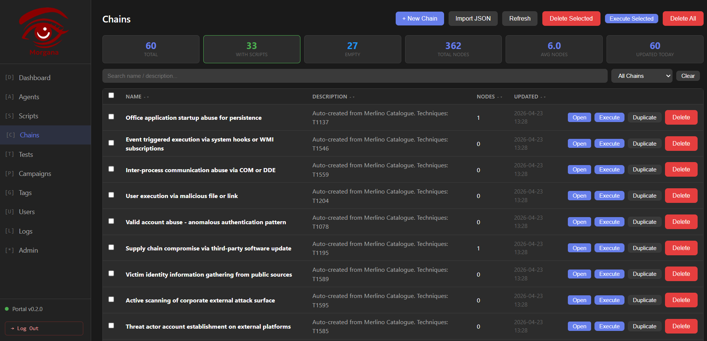
*Figure 314: The Chains page in Morgana after synchronization. Each chain corresponds to a Catalogue entry and contains the ATT&CK techniques from the TCodes column as ordered scripts.*

> **Key Concept:** The **Name** column in Merlino's Catalogue is the unique identifier that links entries across both systems. The names in Merlino's Catalogue, Tests, and Morgana's Chains all correspond.

Now go to Step 8 to execute the chains from the Morgana web UI.

---

## 9. Step 8 -- Run Tests in Morgana

Now comes the actual Red Team testing. You will execute the chains directly from the Morgana web UI against the target machine.

### Navigate to Chains in Morgana

1. In the Morgana web UI, click **Chains** in the navigation.
2. You will see the list of chains created by Synchronize Chains from Merlino.

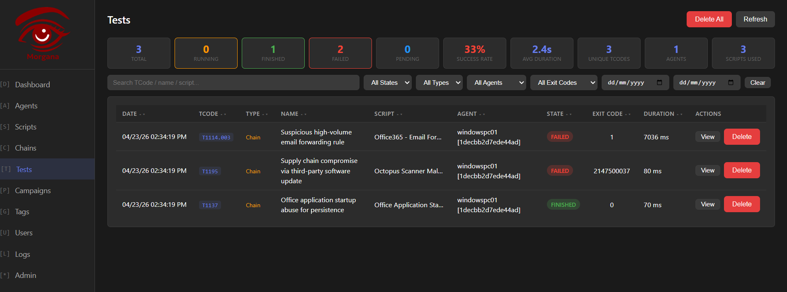
*Morgana — Chains list ready for execution. Select one or all chains and click Execute to start Red Team testing.*

### Execute Chains

You have two options:

**Option A -- Execute all chains at once:**
1. Select all chains using the checkbox at the top of the list.
2. Click the **Execute** button.
3. Morgana dispatches all chains to the available agents simultaneously.

**Option B -- Execute chains one by one:**
1. Click on a chain name to open it.
2. Review the scripts in execution order.
3. Click **Execute** to start that chain on the target agent.
4. Repeat for each chain you want to run.

### Agent Assignment

If a chain has no agent associated, Morgana will prompt you to select a temporary agent for execution before proceeding. Select the target agent from the dropdown and confirm.

### Monitor Execution

As chains run, each script shows a **status**:
  - **Green (0):** Script executed successfully -- the technique was performed on the target.
  - **Red (-1):** Script failed or was blocked -- the target's defenses prevented execution.
  - **Blue (1):** Script is currently running.

You can click on any script to see its command output, execution time, and detailed results.

> **What a Successful Execution Means:** A successfully executed script (status 0) means the adversary technique was carried out on the target machine:
> - If your Sentinel rule **did not fire**, you have a confirmed detection gap.
> - If your Sentinel rule **did fire**, the detection is validated.
> - If your EDR **blocked** the script (status -1), your endpoint protection is working for that technique.

Once you have executed the chains you want to test, return to Merlino to pull the results back (next step).

---

## 10. Step 9 -- Synchronize Back to Merlino (Post-Execution)

After running one or more operations, you need to pull the results back into Merlino.

### Return to Merlino

1. Go back to Excel and the Merlino workbook.
2. Open the **Tests & Operations** taskpane.

### Click Synchronize Tests Again

1. Click the **Synchronize Tests** button.
2. This time, the synchronization pulls execution results from Morgana:
   - **Script execution status** (success, failed, or running) for each technique.
   - **Agent information** (which agents executed which scripts).
   - **Command output** and execution details.
3. The Tests table is updated with the latest data from Morgana.
4. The **Operations Intelligence Dashboard** refreshes with updated metrics:
   - **Success Rate** -- percentage of scripts that executed successfully.
   - **Error Rate** -- percentage of scripts that failed or were blocked.
   - **Total Scripts** -- total number of individual scripts executed across all tests.
   - **Agent Count** -- number of active agents involved.

The dashboard provides five analytical views:
- **Graph** -- Force-directed graph showing relationships between operations, techniques, and agents.
- **Success** -- Detailed breakdown of successful vs. failed scripts.
- **Health** -- Agent health and connectivity status.
- **Errors** -- Error analysis and troubleshooting information.
- **Metrics** -- Aggregated KPIs and performance metrics.

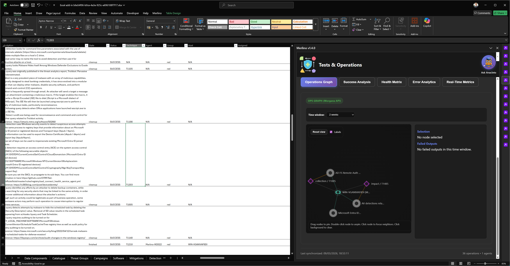
*Figure 309: After the second synchronization, the Tests table shows execution results and the Operations Intelligence Dashboard displays real-time analytics including success rates, agent activity, and technique coverage.*

---

## 11. Step 10 -- Understanding the Tests Table After Synchronization

After synchronizing with Morgana, the Tests table will contain **more rows than you originally had in the Catalogue**. This is expected and correct.

### Why More Rows?

Each entry in your Catalogue maps to a single ATT&CK technique (or a small set of techniques). But when Morgana executes a test, each technique is implemented by one or more **scripts**. A script is a specific, concrete action that implements the technique on a particular platform (sourced from the Atomic Red Team library or custom-defined).

For example:

| Catalogue Entry | Technique | Morgana Scripts |
|---|---|---|
| LSASS Credential Dumping | T1003.001 | Dump LSASS with Mimikatz, Dump LSASS with procdump, Dump LSASS with comsvcs.dll, Dump LSASS via direct memory access |
| PowerShell Execution | T1059.001 | Download cradle via PowerShell, Encoded PowerShell command, PowerShell without logging, PowerShell bypass execution policy |
| Disable Security Tools | T1562.001 | Disable Windows Defender real-time, Disable Windows Firewall, Stop security service, Modify registry security settings |

A single Catalogue entry for T1003 may produce 4-8 rows in the Tests table -- one for each script that Morgana used to test that technique. This is the expected behavior and provides granular visibility into which specific implementations of a technique succeeded or failed.

### Key Columns in the Tests Table

| Column | Description | Example Values |
|---|---|---|
| **Pick** | Boolean flag for filtering | TRUE / FALSE |
| **CrossPick** | Cross-table coverage percentage | 0-100 |
| **TCodes** | ATT&CK technique codes | T1003.001, T1059.001 |
| **Name** | Catalogue entry name | LSASS Credential Dumping |
| **Test** | Morgana test name | LSASS Credential Dumping |
| **Chain** | Morgana chain name | LSASS Credential Dumping |
| **State** | Test execution state | running, finished, cleanup |
| **Status** | Script execution status | 0 (success), -1 (failed), 1 (running) |
| **Output** | Command output from the agent | Base64-encoded execution output |
| **Command** | The command that was executed | mimikatz.exe sekurlsa::logonpasswords |
| **Agents** | Number of participating agents | 1, 2, 3... |
| **Group** | Agent group | red |

> **For more information** about Morgana scripts, chains, and tests, see the [Morgana Install & Documentation page](https://github.com/x3m-ai/Camelot/tree/main/morgana/Install) in the Camelot community repository.

### Operations Intelligence Dashboard -- Analytical Views

Beyond the raw data in the Tests table, the **Operations Intelligence Dashboard** in the Tests & Operations taskpane provides five powerful analytical views. Each view is accessible via a tab at the top of the dashboard section. Together, they give you a complete operational picture of your Red Team campaign.

#### OPS Graph

The OPS Graph is an **interactive force-directed graph** that visualizes the relationships between your tests, tactics, techniques, and procedures (TTPs). Nodes represent tests, ATT&CK tactics, and individual techniques. Edges show which techniques belong to which tactics and which tests validated them.

You can **drag** nodes to rearrange the layout, **hover** over any node to highlight its connections, and **click** on a node to isolate its neighborhood. The graph automatically clusters related elements together, making it easy to spot which tactical areas have the most test coverage and which are underrepresented.

This view is particularly useful for briefings and reports -- it provides an immediate, visual answer to the question: *"What did we test and how does it map to the ATT&CK framework?"*

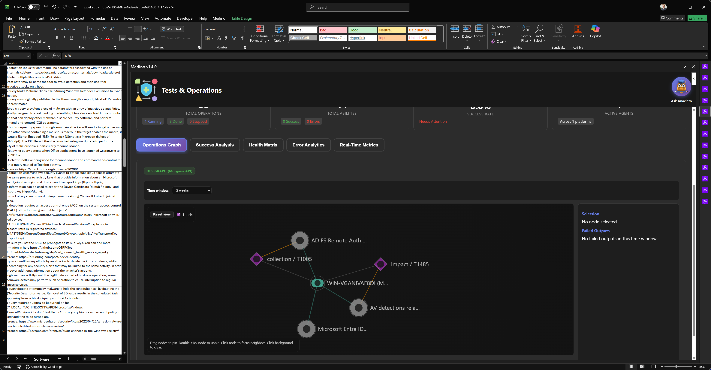
*Figure 318: The OPS Graph -- an interactive force-directed visualization showing the relationships between tests, ATT&CK tactics, and techniques. Drag, hover, and click nodes to explore the data.*

#### Script Success Rate Analysis

The Script Success Rate Analysis view breaks down the execution results across all tests. It shows the **percentage of scripts that succeeded (status 0), failed (status -1), and are still running (status 1)** -- both as an aggregate summary and per-test breakdown.

This view answers the critical question: *"Of everything we tested, how much actually worked?"* A high success rate (many green/status 0) means the attack techniques were executed successfully on the target -- which is valuable for identifying detection gaps. A high failure rate (many red/status -1) indicates that your endpoint defenses are blocking those specific technique implementations.

Use this view to prioritize follow-up actions: techniques that succeeded without triggering a Sentinel alert are your highest-priority detection gaps.

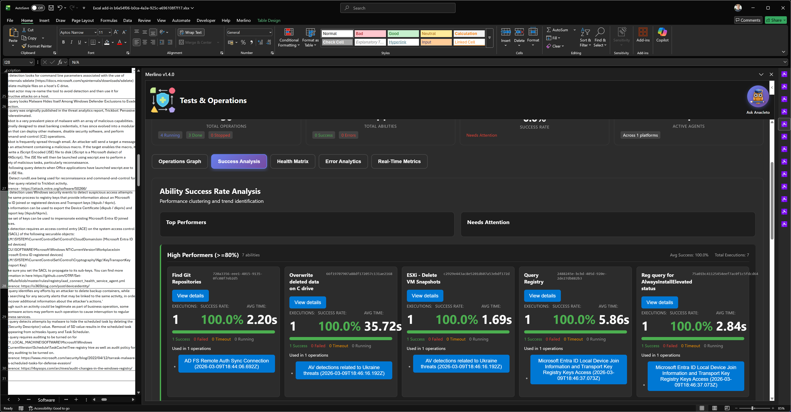
*Figure 319: The Script Success Rate Analysis view. Green bars represent successful script executions, red bars represent blocked or failed scripts. Use this data to identify which techniques bypassed your defenses.*

#### Test Health Matrix

The Test Health Matrix provides a comprehensive overview of **agent health, connectivity, and test state** across your entire Red Team campaign. It shows which agents are alive, which have gone offline, how long each agent has been connected, and the current state of every test (running, finished, or cleanup).

This view is essential for **operational awareness during active testing**. If an agent disconnects mid-test, the Health Matrix highlights it immediately so you can troubleshoot (e.g., the target machine rebooted, the agent process was killed by an EDR, or a network issue interrupted communication). It also tracks test completion status so you know which tests have finished and which are still in progress.

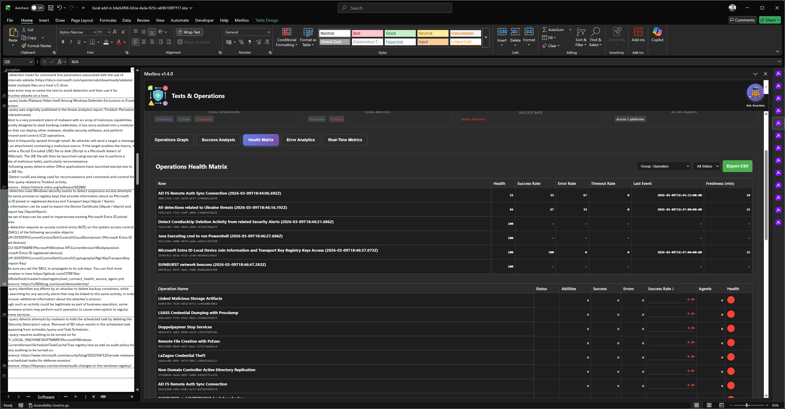
*Figure 320: The Test Health Matrix. Each row represents an agent with its hostname, platform, group, and connectivity status. Test states are shown alongside agent health indicators.*

#### Error Analytics and Troubleshooting

The Error Analytics view aggregates all **errors, failures, and anomalies** from your tests into a single diagnostic interface. It categorizes errors by type (agent communication failures, script execution errors, timeout issues, permission denied) and provides the detailed error messages and command output for each failed script.

This view is your **first stop when something goes wrong**. Instead of manually reviewing each failed script across multiple tests, the Error Analytics view consolidates everything and highlights patterns. For example, if multiple scripts fail with "Access Denied", it likely means the agent does not have sufficient privileges -- you may need to run the agent as Administrator. If scripts time out consistently, the agent may be under heavy load or the network connection to Morgana is unstable.

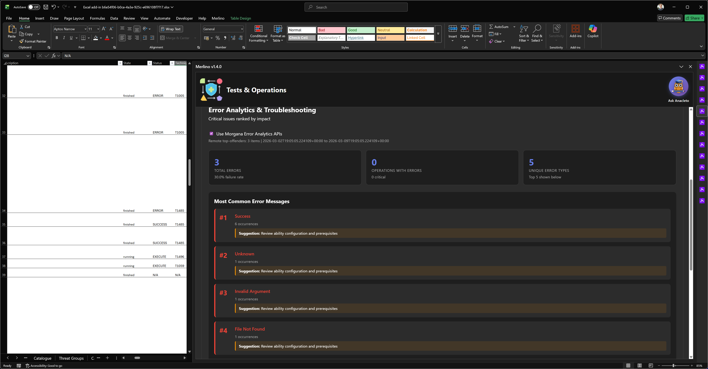
*Figure 321: The Error Analytics and Troubleshooting view. Errors are categorized by type with detailed messages and command output. Use this view to diagnose and resolve operational issues.*

#### Real-Time Operations Metrics

The Real-Time Operations Metrics view displays **live KPIs and aggregated statistics** for your entire Red Team campaign. Key metrics include:

- **Total Tests** -- number of tests executed
- **Total Scripts** -- total number of individual script executions across all tests
- **Overall Success Rate** -- percentage of scripts that completed successfully
- **Average Execution Time** -- mean time per script execution
- **Agent Utilization** -- how many agents are actively participating vs. idle
- **Technique Coverage** -- number of unique ATT&CK techniques tested vs. total in your threat profile

This view provides the **executive summary** of your Red Team engagement. The metrics are updated in real-time as tests run and are refreshed each time you click Synchronize Tests. Use these numbers for reporting to management, compliance documentation, and tracking improvement over time as you repeat the validation cycle.

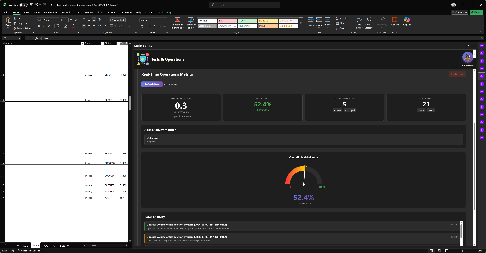
*Figure 322: Real-Time Operations Metrics displaying live KPIs including total tests, scripts executed, success rates, average execution time, and technique coverage against your threat profile.*

---

## 12. Step 11 -- Push Intelligence to MISP

Now that you have Red Team execution data in your Merlino workbook, you can push this intelligence to MISP. This creates events in your MISP instance that correlate your Catalogue data (threat groups, techniques, Sentinel rules) with real execution results -- enabling powerful cross-referencing and threat intelligence sharing.

### Open the IOC Taskpane

1. Click the **IOC** button in the Merlino ribbon (Operations group).
2. The IOC taskpane opens with several action buttons.

### Push Catalogue Data to MISP

1. Click the **Catalogue to MISP** button.
2. Merlino reads all rows from the Catalogue table and creates one MISP event for each entry.
3. Each MISP event includes:
   - Event name (from the Catalogue Name column)
   - ATT&CK technique tags (from the TCodes column)
   - Description and source information
   - Attributes mapped from Catalogue data
4. A progress bar shows the push progress.
5. When complete, a notification confirms how many events were created.

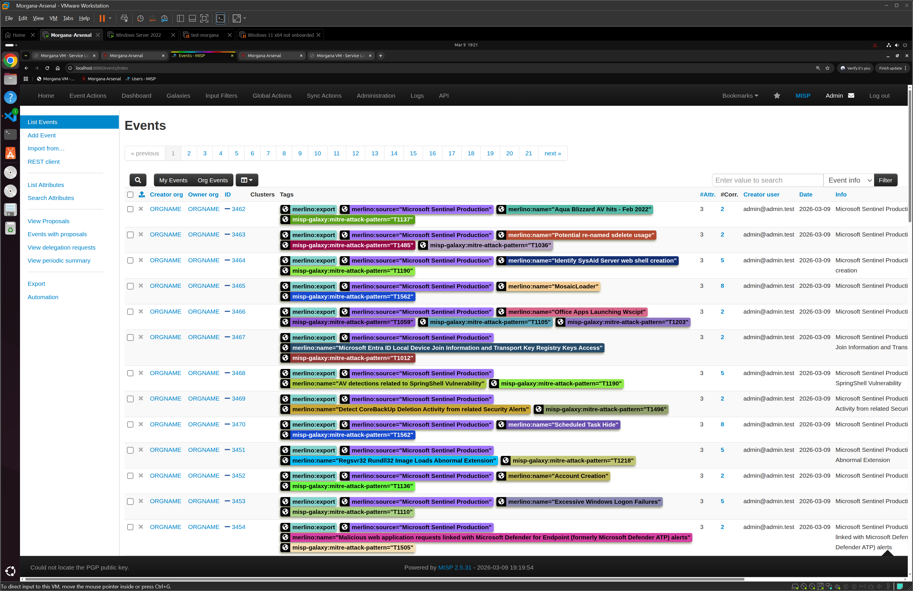
*Figure 310: Pushing Catalogue data to MISP using the Catalogue to MISP button. Each Catalogue entry becomes a MISP event with ATT&CK technique tags and associated attributes.*

### Why Push to MISP?

Pushing data to MISP creates powerful relationships:
- **ATT&CK technique correlation** -- MISP can correlate your techniques with known threat actors, campaigns, and IOCs from the broader threat intelligence community.
- **IOC enrichment** -- MISP feeds can add IP addresses, domains, file hashes, and other indicators related to the techniques you are testing.
- **Sharing** -- If your MISP instance participates in sharing communities, your validated threat intelligence becomes part of a broader defensive ecosystem.
- **Historical tracking** -- MISP events provide a timestamped audit trail of your threat intelligence and Red Team activities.

---

## 13. Step 12 -- Import IOC Data from MISP

After pushing data to MISP (and allowing time for MISP to correlate it with existing feeds and events), you can pull enriched IOC data back into Merlino.

### Import All Events from MISP

1. In the IOC taskpane, click the **Import from MISP** button.
2. Merlino connects to your MISP instance, retrieves events, and writes the data to the **IOC** sheet.
3. The IOC sheet is created (if it does not exist) with 16 columns including: Pick, CrossPick, TCodes, Name, Source, Description, IPs, Domains, Hashes, CVEs, Threat Actors, Campaigns, Risk Score, MISP Event ID, MISP Event Link, Last Updated, and Related Events.
4. Each row in the IOC table represents a MISP event with its associated indicators.

### Import by Pick Criteria (Filtered Import)

If you only want to import MISP data that is relevant to your current threat profile (the rows marked `Pick=TRUE` in your workbook), use the filtered import:

1. Click the **Preview Criteria** button first. This scans your workbook for all `Pick=TRUE` rows and displays the matching criteria:
   - TCodes from picked rows
   - Threat Actors and Groups
   - Campaigns
   - CVEs
   - Software and Malware
2. Review the criteria summary to confirm it matches your expectations.
3. Click the **Import by Pick Criteria** button.
4. Merlino queries MISP using only the criteria extracted from your picked rows, filtering out irrelevant events.
5. The result is a focused IOC dataset that directly relates to your threat profile.

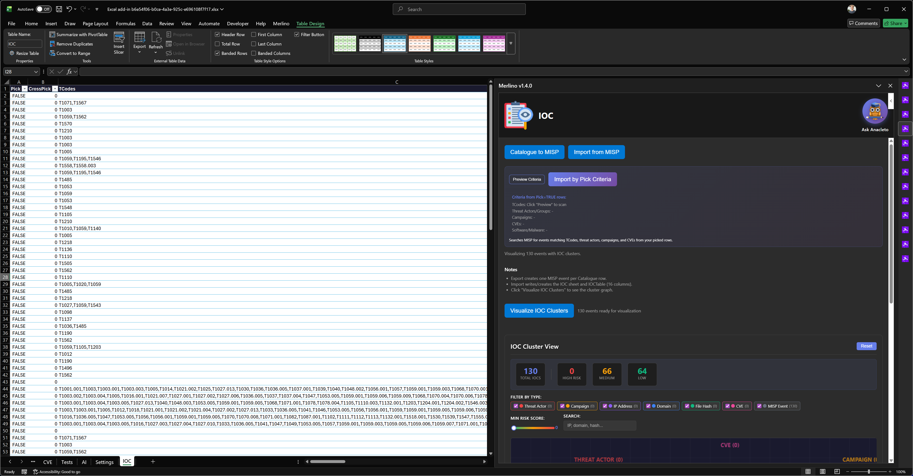
*Figure 311: The Import by Pick Criteria feature extracts TCodes, threat actors, campaigns, and CVEs from your Pick=TRUE rows and uses them to filter the MISP import. This ensures you only receive IOC data relevant to your threat profile.*

---

## 14. Step 13 -- Visualize IOC Clusters

The final analytical step is to visualize the relationships between your IOC data and your Merlino intelligence using the IOC Cluster Graph.

### Generate the Cluster Visualization

1. In the IOC taskpane, scroll down to the visualization section.
2. Click the **Visualize IOC Clusters** button.
3. Merlino reads the IOC table and generates an interactive cluster graph that shows:
   - **MISP Events** (gray nodes) -- the events imported from MISP.
   - **Threat Actors** (red nodes) -- threat actors extracted from the events.
   - **Campaigns** (orange nodes) -- campaigns associated with the events.
   - **IP Addresses** (purple nodes) -- IP indicators from MISP attributes.
   - **Domains** (blue nodes) -- domain indicators.
   - **File Hashes** (green nodes) -- hash indicators (MD5, SHA-1, SHA-256).
   - **CVEs** (pink nodes) -- vulnerabilities linked to the events.

4. The graph is interactive:
   - **Drag** nodes to reposition them.
   - **Hover** over nodes to see details.
   - **Click** on a node to highlight its connections.
   - Use the legend to filter IOC types on and off.

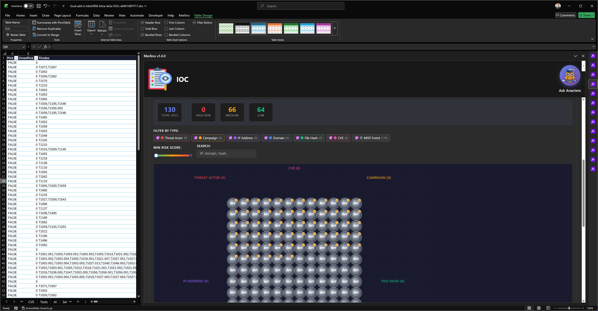
*Figure 312: The IOC Cluster Graph visualizes relationships between MISP events and their associated indicators. Red nodes are threat actors, purple nodes are IP addresses, blue nodes are domains, and gray nodes are MISP events. Lines show which indicators appear in which events.*

### What to Look For

- **Clusters** -- Groups of nodes that are heavily interconnected indicate IOCs that appear together across multiple events. These are likely associated with the same threat actor or campaign.
- **Bridge Nodes** -- IOC nodes that connect two otherwise separate clusters are especially interesting -- they may indicate shared infrastructure between different threat groups.
- **High-Count Nodes** -- IOCs that appear in many events (large nodes) deserve priority investigation.
- **Your ATT&CK Techniques** -- The TCodes associated with each event connect the IOC data back to your Merlino Catalogue and threat profile, closing the analytical loop.

---

## 15. Step 14 -- Explore the Agents Dashboard

While the Tests & Operations taskpane focuses on tests and scripts, the **Agents** taskpane provides a dedicated view into the agents that execute those tests. This is where you monitor your Red Team infrastructure -- the machines you control, their status, and their activity across the entire campaign.

### Open the Agents Taskpane

1. Click the **Agents** button in the Merlino ribbon (Operations group).
2. The Agents taskpane opens and immediately queries Morgana for the current agent inventory.

### Agents Overview

The first view you see is the **Agents Overview** -- a summary panel showing all agents currently registered in Morgana. For each agent, the overview displays:

- **Hostname** -- the machine name where the agent is running.
- **Platform** -- the operating system (Windows, Linux, Darwin).
- **Architecture** -- the CPU architecture (x86_64, ARM, etc.).
- **Agent Group** -- the group assignment (e.g., `red`) that determines which tests target this agent.
- **Contact** -- the communication protocol the agent uses to reach the Morgana server (HTTPS).
- **Status** -- whether the agent is **alive** (actively communicating) or **dead** (no heartbeat received within the timeout window).
- **Last Seen** -- the timestamp of the last heartbeat, so you can tell at a glance how recently each agent checked in.

This overview is essential for operational awareness: before launching new tests, you need to confirm that your agents are alive and reachable. If an agent shows as dead, the target machine may have rebooted, the agent process may have been terminated by an EDR, or a network issue may be preventing communication.

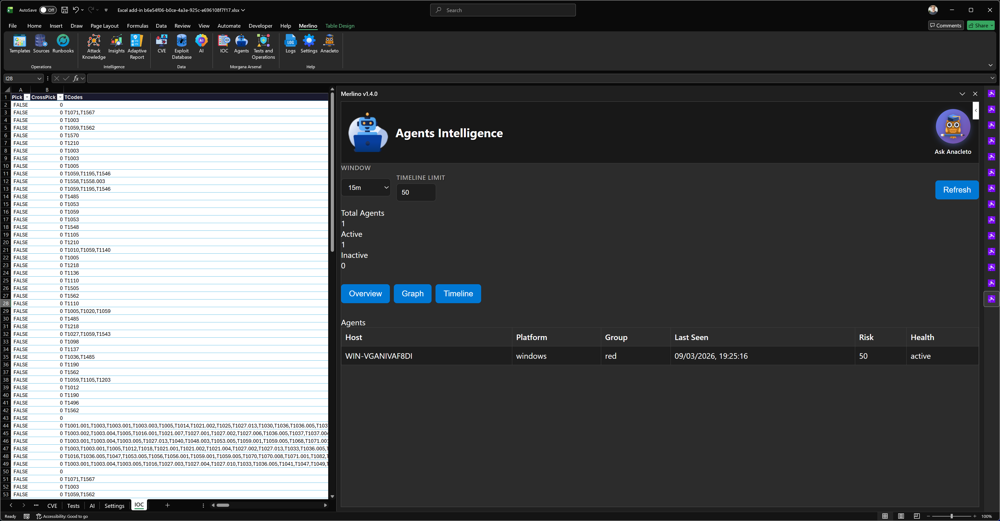
*Figure 323: The Agents Overview in the Agents taskpane. Each agent is listed with its hostname, platform, architecture, group, contact method, and live status. Use this view to confirm agent availability before running tests.*

### Agents Relationship Graph and Timeline

Below the overview, the Agents taskpane provides an **interactive force-directed graph** that visualizes the relationships between agents and their activities. The graph contains three types of nodes:

- **Agent nodes** (center) -- represent each registered agent, labeled with the hostname.
- **Test nodes** -- represent tests that the agent participated in, connected by edges to the agent that executed them.
- **Script nodes** -- represent individual scripts (attack techniques) executed by the agent, connected to the test they belong to.

Edges encode the execution flow: Agent --> Test --> Script. The thickness and color of each edge can indicate the execution status (success, failure, or running), giving you an immediate visual understanding of how each agent contributed to your Red Team campaign.

You can **drag** nodes to rearrange the layout, **hover** over a node to highlight its connections, and **click** on a node to see details such as the test name, script description, and execution status.

Below the graph, a **timeline** shows agent activity over time -- when each agent first connected, when it executed scripts, and when it last reported in. The timeline helps you reconstruct the chronological sequence of events during a multi-agent, multi-test campaign.

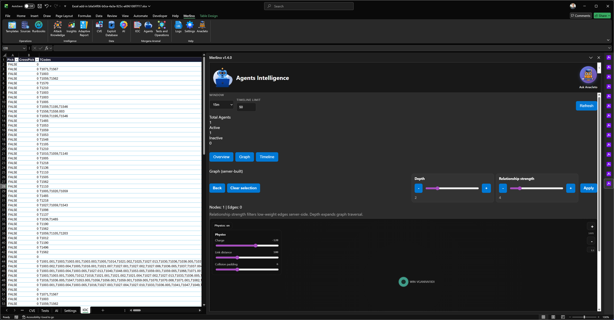
*Figure 324: The Agents Relationship Graph and Timeline. Agent nodes connect to the tests they executed and the individual scripts within those tests. The timeline below shows agent activity chronologically. Use this view to understand how your Red Team infrastructure participated in the campaign.*

### When to Use the Agents Dashboard

- **Before running tests** -- verify that all target agents are alive and in the correct group.
- **During active tests** -- monitor agent participation and spot disconnections in real-time.
- **After tests complete** -- review the graph to understand which agents tested which techniques, and use the timeline to reconstruct the sequence of events for reporting.
- **Troubleshooting** -- if a test produced unexpected results, the Agents dashboard helps you determine whether the issue was with a specific agent (e.g., dead agent, wrong group) rather than with the test or chain definition itself.

---

## 16. The Complete Security Validation Loop

At the end of Lab 03, step back and see what you have built across all three labs:

```
LAB 01: THREAT INTELLIGENCE
  |
  |   Who attacks organizations like ours?
  |   Which ATT&CK techniques do they use?
  |   --> Threat Profile (6 APT groups, 200+ techniques)
  |
  v
LAB 02: DETECTION MEASUREMENT
  |
  |   How much of that threat landscape do our Sentinel rules cover?
  |   Where are the detection gaps?
  |   --> Detection Coverage Map (41 rules vs. threat profile)
  |
  v
LAB 03: RED TEAM VALIDATION
  |
  |   Can we actually execute those techniques against our infrastructure?
  |   Does our detection work when the attack happens for real?
  |   --> Execution Results (scripts tested, success/failure data)
  |
  v
MISP: THREAT INTELLIGENCE SHARING
      |
      |   What IOCs are associated with our threat profile?
      |   What relationships exist between our data and the broader community?
      |   --> IOC Correlation (IPs, domains, hashes, CVEs linked to techniques)
```

This is not a one-time exercise. The loop is designed to be repeated:

1. **New threat intelligence** emerges (a new APT group targets your industry) --> Repeat Lab 01 to update the threat profile.
2. **New Sentinel rules** are deployed --> Repeat Lab 02 to measure improved coverage.
3. **New Morgana scripts** are available --> Repeat Lab 03 to validate against the latest attack implementations.
4. **MISP feeds** update with fresh IOCs --> Re-import and re-visualize to catch new relationships.

Each iteration tightens the security posture. Each iteration produces measurable, evidence-based data. Each iteration is documented in the Merlino workbook -- a living, auditable artifact.

---

## 17. Summary and Next Steps

### What You Accomplished in This Lab

| Step | What You Did | What It Produced |
|---|---|---|
| Prepared Tests sheet | Cleared existing data, preserved header | A clean Tests table ready for synchronization |
| Synchronized Chains | Pushed Catalogue entries to Morgana as chains | Chains with scripts created in Morgana for every technique in your profile |
| Installed Morgana | Installed Morgana Server using the community installer | A running Red Team server ready for testing |
| Configured connections | Entered Morgana and MISP details in Settings | Verified green-status connections to both services |
| Deployed agent | Installed a Morgana agent on a Windows target | A connected agent ready to receive and execute scripts |
| First test sync | Created and executed tests from chains in Morgana | Test executions dispatched to agents |
| Ran tests | Executed attack techniques against the target | Script execution results (success/failure per technique) |
| Post-execution sync | Pulled results back into Merlino via Synchronize Tests | Updated Tests table with status, output, and metrics |
| Pushed to MISP | Exported Catalogue data to MISP events | Correlated threat intelligence in MISP |
| Imported from MISP | Pulled enriched IOC data into IOC sheet | IP, domain, hash, and CVE indicators linked to your profile |
| Visualized IOCs | Generated IOC Cluster Graph | Interactive visualization of threat intelligence relationships |

### Key Takeaways

1. **Detection rules are hypotheses. Red Team tests are experiments.** You cannot know if your defenses work until you test them. Lab 02 measured what you have on paper; Lab 03 validated what works in practice.
2. **More rows in the Tests table is a good thing.** Each row represents a specific script -- a concrete action that was attempted against your target. Granularity is precision.
3. **Failed scripts (status -1) are not failures -- they are evidence that your defenses work.** A script that was blocked by your EDR means that specific technique implementation is covered. Document it. Celebrate it.
4. **The bidirectional Morgana sync is designed for iteration.** Run tests, sync results, run more tests, sync again. Each cycle adds more data to your workbook.
5. **MISP integration transforms isolated Red Team data into shareable intelligence.** By pushing to MISP and pulling IOCs back, you connect your internal validation program to the broader threat intelligence ecosystem.

### Resources

- **Morgana:** [github.com/x3m-ai/Camelot -- morgana/Install/](https://github.com/x3m-ai/Camelot/tree/main/morgana/Install) -- Installer, release notes, and full installation guide.
- **Atomic Red Team:** [https://github.com/redcanaryco/atomic-red-team](https://github.com/redcanaryco/atomic-red-team) -- The open-source library of ATT&CK technique tests that Morgana loads as its scripts library.
- **MISP Project:** [https://www.misp-project.org](https://www.misp-project.org) -- The open-source threat intelligence platform documentation.

### What's Next

You have now completed all three Merlino laboratories. Your workbook contains:

- A threat profile based on real threat groups and their ATT&CK techniques
- A detection coverage map showing which techniques your Sentinel rules cover
- Red Team validation results showing which techniques were actually tested and whether they succeeded or were blocked
- IOC data from MISP correlating indicators of compromise with your threat profile

**From here, the workflow is yours.** Some recommended next steps:

- **Run the AI Assistant** (AI button in the ribbon) to generate automated analysis and recommendations based on your combined data.
- **Generate a Report** (Reports button) to produce a comprehensive HTML report covering all three layers of analysis.
- **Share the workbook** with your SOC team, management, or auditors as evidence of your security validation program.
- **Schedule regular cycles** -- update threat intelligence quarterly, re-measure Sentinel coverage after rule changes, and re-run Red Team tests as new scripts are released.

---

**End of Lab 03**

*For additional help, use Anacleto within any taskpane or visit the [Camelot community](https://github.com/x3m-ai/Camelot/discussions).*
